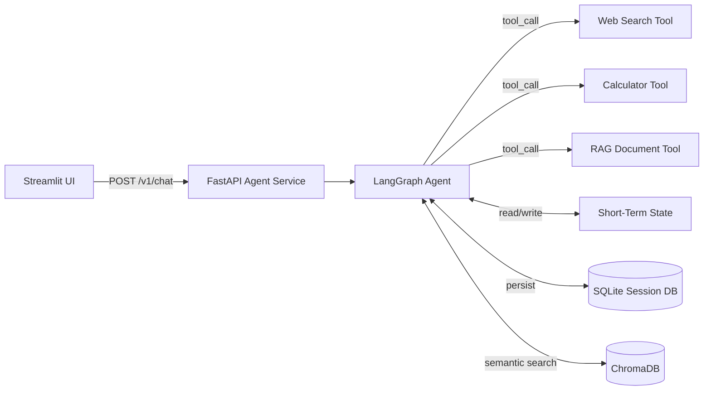

# AI Assistant with Persistent Memory — Elite Agentic System

[](reports/docs/references/technical_roadmap.md)
[](reports/docs/architecture/system_design.md)
[](LICENSE.txt)

> [!IMPORTANT]
> **🚧 2026 ARCHITECTURAL UPGRADE IN PROGRESS**
> This project is currently being transformed from a simple LangChain chat wrapper into a **production-grade agentic system**. We are moving away from ephemeral memory and monolithic classes towards a state-of-the-art **LangGraph orchestration** with a three-layer memory architecture.

---

## The Vision: From Prototype to Elite System

This repository is transitioning from a basic LLM chat interface to a comprehensive showcase of **Agentic MLOps** and production engineering.

### Why This Upgrade?
Elite AI Engineering is not about calling an API; it's about building **robust, stateful, and observable systems**. This upgrade addresses the "Production Gap" by implementing:
- **True Agency**: Moving from `ConversationChain` to a logic-driven **LangGraph StateGraph**.
- **Persistent Memory**: A 3-layer strategy (Session → SQLite → ChromaDB) that survives restarts.
- **Brain/Brawn Separation**: LLMs for reasoning; deterministic Pydantic tools for execution.
- **Production Rigor**: FastAPI microservices, `pyright` type safety, and GitHub Actions CI/CD.

### 🗺️ Project Roadmap & Documentation
We are currently in **Phase 0: Planning & Formalization**. All architectural blueprints are finalized:

*   **[Technical Roadmap](reports/docs/references/technical_roadmap.md)** — The step-by-step execution plan from foundation to polish.
*   **[System Design](reports/docs/architecture/system_design.md)** — Mermaid diagrams of the target-state architecture.
*   **[Architectural Decision Records (ADRs)](reports/docs/decisions/adr-001-langgraph-vs-langchain.md)** — Why we chose LangGraph over LangChain chains.
*   **[Product Requirements (PRD)](reports/docs/references/prd.md)** — The "Personal Assistant" analogy and functional specs.
*   **[Portfolio Upgrade Analysis](reports/docs/evaluations/portfolio_upgrade_analysis.md)** — A clinical diagnosis of the prototype vs. the elite target.

---

## Current Features (Prototype v1.0)

While the upgrade is underway, the current prototype demonstrates a solid foundation:

- **Local and Cloud LLMs**: Run local models (e.g., gemma3) via Docker or switch to cloud models via OpenRouter.
- **Streamlit Interface**: Clean, user-friendly chat UI with message history.
- **Legacy Memory**: Uses LangChain's `ConversationBufferMemory` for session-based context.
- **Containerized**: Fully containerized with Docker Compose.
- **Dependency Management**: Uses `uv` for lightning-fast, reproducible builds.

---

## Quick Start (Current Prototype)

1. **Clone the Repository**:
   ```bash
   git clone https://github.com/SebastianGarrido2790/Data-Science-Portfolio.git
   cd ai-assistant-docker-app
   ```

2. **Configure Environment**:
   ```bash
   cp .env.example .env
   # Edit .env with your OPENROUTER_API_KEY
   ```

3. **Launch**:
   ```bash
   docker compose up --build
   ```

4. **Access**:
   Open `http://localhost:8501` to start chatting.

---

## Target Architecture (Phase 2+)



---

## Technical Standards
We adhere to the **"Python-Development" Standard**:
- **Strict Typing**: `pyright` in standard mode.
- **Dependency Management**: `uv` for resolution.
- **Linting**: `ruff` mandatory.
- **Architecture**: Decoupled microservices (FastAPI + Streamlit).

---

## Contact & Contributions

For questions regarding the architectural upgrade or to contribute to the roadmap, please contact **Sebastian Garrido** at `sebastiangarrido2790@gmail.com`.

---
*Follow the progress in the [Technical Roadmap](reports/docs/references/technical_roadmap.md).*
