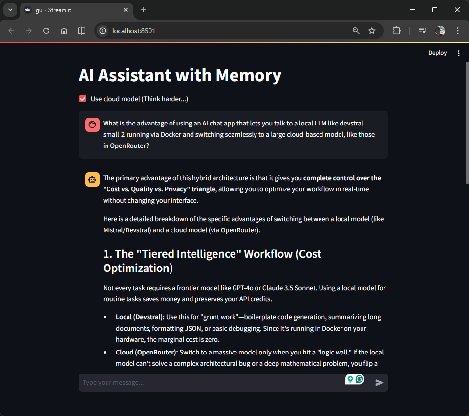
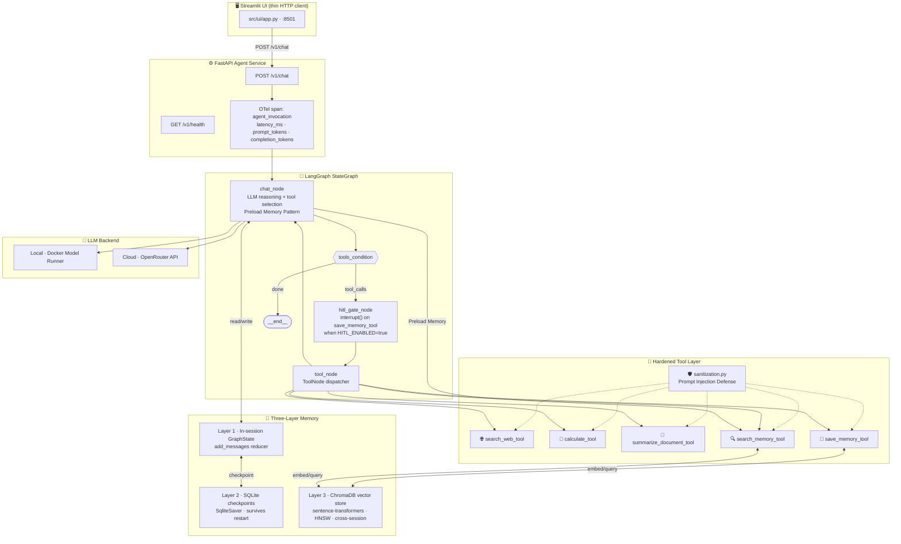
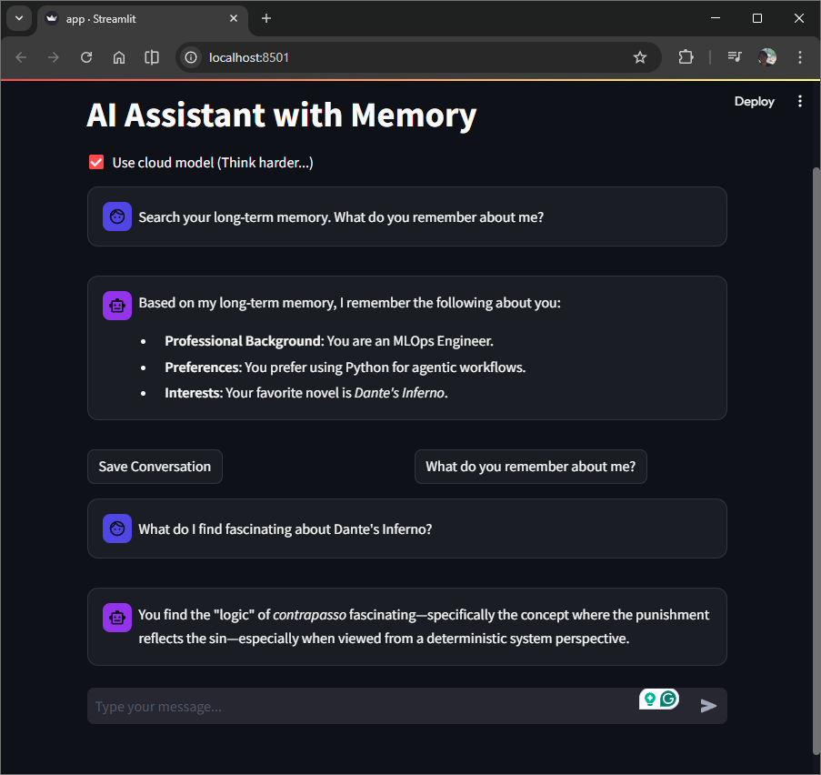

# AI Assistant with Persistent Memory

[](https://github.com/SebastianGarrido2790/ai-assistant-docker-app/actions/workflows/ci.yml)
[](https://www.python.org/)
[](https://github.com/langchain-ai/langgraph)
[](https://fastapi.tiangolo.com/)
[](https://www.docker.com/)
[](https://github.com/SebastianGarrido2790/ai-assistant-docker-app/actions)
[](LICENSE.txt)

A production-grade agentic AI assistant built on **LangGraph**, **FastAPI**, and a **three-layer memory architecture**. The agent uses real tools (web search, calculator, document summarization, long-term memory), persists full conversation state to SQLite, retrieves cross-session facts from a ChromaDB vector store, and defends all tool inputs against prompt injection — all observable via OpenTelemetry tracing.



---

## Architecture



---

## Why This Is Hard

Most LLM demos are wrappers around a single API call. This system is not. Each of the following design problems has a non-obvious solution:

### 1. Memory that actually persists

Three distinct memory scopes require three distinct implementations. Short-term context is held in `GraphState` using `add_messages` reducers. Session persistence across container restarts uses `SqliteSaver` keyed by `thread_id`. Cross-session semantic recall uses ChromaDB's HNSW index with `sentence-transformers` embeddings. These are not interchangeable; they serve different temporal scopes and failure modes.

The hard part: ChromaDB's default embedding engine silently fails if `onnxruntime` is not pinned in `pyproject.toml`. Facts appear to save but are never written to the vector store. The fix requires both pinning the dependency *and* wiring a structured logger so the failure is observable.

### 2. Service boundary isolation

The agent graph cannot live in the Streamlit process. Streamlit re-runs the entire script on every interaction, which would instantiate new LLM clients, new SQLite connections, and new ChromaDB handles on every user keystroke. The solution is a FastAPI `lifespan()` context manager that builds the compiled graph exactly once at process startup and stores it on `app.state` as a singleton.

### 3. Environment variable inheritance on Windows

When `start` spawns a child `cmd.exe` process, it breaks the parent shell's environment inheritance chain. The host's `OPENROUTER_API_KEY` is visible in the parent session but `None` in the uvicorn worker. The fix is `uv run --env-file .env`, which injects `.env` contents directly into the child process environment, bypassing Windows inheritance entirely.

### 4. Causal observability across tool calls

A single chat turn may invoke two or three tools before returning a final response. Without distributed tracing, a failure in `save_memory_tool` on turn 3 of a 10-turn conversation is indistinguishable from an LLM error. The solution is a two-layer OpenTelemetry span hierarchy: a root `agent_invocation` span per request with child spans per tool call, each capturing `tool.input` and `tool.output`.

### 5. Prompt injection defense without breaking tool usability

Tools that accept free-text user input are a direct attack surface. A user can craft a message to override the agent's system prompt, exfiltrate the conversation context, or escape the sandbox. The solution is a dedicated `sanitize_tool_input()` gate applied at every tool entry point, using pattern-based regex matching for known injection vectors (instruction overrides, persona hijacking, `<system>` tag escapes, Llama-style `[INST]` tags) with a hard length cap. The gate fails loudly with a structured `ValueError` and OTel-tagged log — never silently.

### 6. Reproducible Docker builds at development speed

Docker invalidates the layer cache when any file in the `COPY` context changes. Copying the entire source directory before `uv sync` means every code edit forces a full dependency reinstall (~2 minutes). The multi-stage build copies only `pyproject.toml` + `uv.lock` first, then runs `uv sync --frozen`. Source code is copied in a later layer that does not invalidate the dependency cache; this rebuilds with no dependency changes complete in seconds.

---

## Quick Start

### Prerequisites

- [Docker Desktop](https://www.docker.com/products/docker-desktop/) with **Docker Model Runner** enabled
- An [OpenRouter API key](https://openrouter.ai/) (for cloud model mode)

### 1. Clone and configure

```bash
git clone https://github.com/SebastianGarrido2790/ai-assistant-docker-app.git
cd ai-assistant-docker-app
cp .env.example .env
# Edit .env — add your OPENROUTER_API_KEY
```

### 2. Launch

```bash
docker compose up --build
```

**Expected output:**

```
[+] Running 3/3
 ✔ Container ai-assistant-docker-app-llm-1       Healthy
 ✔ Container ai-assistant-docker-app-backend-1   Started
 ✔ Container ai-assistant-docker-app-frontend-1  Started

backend-1   | INFO | Initializing Agent Graph...
backend-1   | INFO | Agent Graph initialized.
backend-1   | INFO | Application startup complete.
```

### 3. Open the UI

Navigate to **[http://localhost:8501](http://localhost:8501)**.

- Toggle **Use Cloud Model** in the sidebar to switch between the local Docker Model Runner and OpenRouter.
- Click **"What do you remember about me?"** to demonstrate cross-session long-term memory recall.



- The session ID persists conversation history across browser refreshes.

### 4. Verify the API directly

```bash
# Health check
curl http://localhost:8000/v1/health

# Expected:
# {"status":"healthy","model":"google/gemma-4-31b-it","memory_backend":"SQLite + ChromaDB"}

# Send a chat message
curl -X POST http://localhost:8000/v1/chat \
  -H "Content-Type: application/json" \
  -d '{"prompt": "My name is Sebastian and I prefer concise answers.", "session_id": "demo-001", "use_cloud": true}'
```

### Local development (without Docker)

For developers working directly on the host machine, the system includes two automation scripts to ensure environment parity:

1. **[launch_system.bat](launch_system.bat)**: One-click launcher that starts the FastAPI backend and Streamlit frontend in parallel, correctly injecting `.env` and `PYTHONPATH`.
2. **[validate_system.bat](validate_system.bat)**: Local CI mirror that runs the "4 pillars of quality" (Ruff, Pyright, Bandit, Pytest, and Port validation) before you push.

```bash
uv sync
.\launch_system.bat       # Windows: starts FastAPI + Streamlit in separate processes
.\validate_system.bat     # Run full local CI suite (pyright + ruff + bandit + pytest + port checks)
```

---

## Production Engineering Signals

| Signal | Implementation |
|--------|---------------|
| Agent orchestration | LangGraph `StateGraph` with `ToolNode` + `tools_condition` + `hitl_gate_node` |
| Three-layer memory | In-session `GraphState` → `SqliteSaver` (SQLite) → ChromaDB (HNSW vector store) |
| API boundary | FastAPI `lifespan()` singleton + Pydantic v2 request/response contracts |
| Tool contracts | Pydantic `BaseModel` input schemas in `src/entity/agent_tools.py` (contract layer) |
| **Prompt injection defense** | **`sanitize_tool_input()` gate on all 5 tools — pattern matching + length cap + loud failure** |
| **HITL governance** | **LangGraph `interrupt()` on `save_memory_tool` — human approval before irreversible writes** |
| Observability | Loguru JSON logs + OpenTelemetry two-layer span hierarchy per request |
| Type safety | `pyright` standard mode — 0 errors; `ruff` — 0 violations |
| Container security | Multi-stage Dockerfile, non-root `appuser`, OS hardening (`apt-get upgrade`), Trivy CVE scanning |
| CI/CD | 3-stage GitHub Actions: quality-gate → pytest 80%+ coverage → docker build + Trivy |
| Prompt governance | Versioned `SYSTEM_PROMPT_V1` registry in `src/agents/prompts.py` — no naked prompts |
| Config isolation | 3-tier priority chain prevents host env var leakage into Docker containers |

---

## Project Structure

```
ai-assistant-docker-app/
├── src/
│   ├── agents/
│   │   ├── graph.py        # LangGraph StateGraph + ToolNode + HITL gate + Preload Memory Pattern
│   │   ├── memory.py       # ChromaDB PersistentClient (Layer 3)
│   │   └── prompts.py      # Versioned system prompt registry
│   ├── api/
│   │   └── app.py          # FastAPI lifespan + OTel spans + token metrics
│   ├── tools/
│   │   └── tools.py        # 5 hardened @tool functions with OTel child spans
│   ├── entity/
│   │   ├── schema.py       # API request/response models (Pydantic v2)
│   │   └── agent_tools.py  # Tool input contracts (Pydantic v2)
│   ├── config/
│   │   └── configuration.py # 3-tier priority ConfigurationManager
│   ├── utils/
│   │   ├── logger.py       # Loguru JSON + enqueued sinks
│   │   ├── telemetry.py    # OpenTelemetry TracerProvider + BatchSpanProcessor
│   │   ├── sanitization.py # 🛡️ Prompt injection defense layer
│   │   └── exceptions.py   # Custom exception hierarchy
│   └── ui/
│       ├── app.py          # Thin Streamlit entry point
│       ├── client.py       # HTTP interaction layer (isolated)
│       ├── components.py   # Reusable render functions
│       └── styles.py       # Glassmorphism CSS design system
├── tests/                  # 8 test modules — 30 tests — 80%+ coverage gate
│   ├── test_api.py
│   ├── test_configuration.py
│   ├── test_exceptions.py
│   ├── test_memory.py
│   ├── test_schema.py
│   ├── test_security.py    # 🛡️ Prompt injection defense tests
│   ├── test_tools.py
│   ├── test_ui.py
│   └── conftest.py
├── reports/docs/
│   ├── architecture/system_design.md      # As-built architecture v4.1.0 (Mermaid)
│   ├── decisions/adr-001-langgraph-vs-langchain.md
│   ├── runbooks/test_suite.md             # Test strategy and coverage report
│   ├── workflows/phase_1/2/3/4/5_*.md    # Implementation records
│   └── evaluations/codebase_review.md    # Readiness review (10.0/10)
├── .github/workflows/ci.yml  # 3-stage GitHub Actions pipeline
├── Dockerfile                # Multi-stage build + OS hardening
├── docker-compose.yaml       # backend · frontend · llm · jaeger services
├── validate_system.bat       # Local CI mirror (4 pillars)
└── launch_system.bat         # One-click hybrid launcher
```

---

## Documentation

| Document | Description |
|----------|-------------|
| [Project Charter](reports/docs/references/project_charter.md) | Original project charter defining goals, scope, and deliverables |
| [System Design](reports/docs/architecture/system_design.md) | As-built architecture v4.1.0 with 11 Mermaid diagrams |
| [Test Suite Runbook](reports/docs/runbooks/test_suite.md) | Testing strategy, 30 tests, 80%+ coverage breakdown |
| [Model Card](reports/docs/model_card.md) | Intended use, limitations, ethics, and performance caveats |
| [ADR-001: LangGraph vs LangChain](reports/docs/decisions/adr-001-langgraph-vs-langchain.md) | Why LangGraph over bare chains |
| [Portfolio Differentiation](reports/docs/decisions/portfolio_differentation.md) | Engineering choices that distinguish this from typical LLM demos |
| [Phase 1 — Foundation Hardening](reports/docs/workflows/phase_1_foundation_hardening.md) | Modular src/, toolchain, multi-stage Docker |
| [Phase 2 — Agentic Upgrade](reports/docs/workflows/phase_2_agentic_upgrade.md) | Tools, three-layer memory, prompt registry |
| [Phase 3 — Production Engineering](reports/docs/workflows/phase_3_production_engineering.md) | FastAPI decoupling, CI/CD, observability, UI modularization |
| [Codebase Review](reports/docs/evaluations/codebase_review.md) | Final readiness assessment (10.0/10) |

---

## Contact

**Sebastian Garrido** · [sebastiangarrido2790@gmail.com](mailto:sebastiangarrido2790@gmail.com) · [GitHub](https://github.com/SebastianGarrido2790)