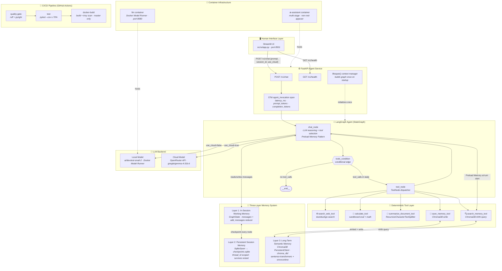
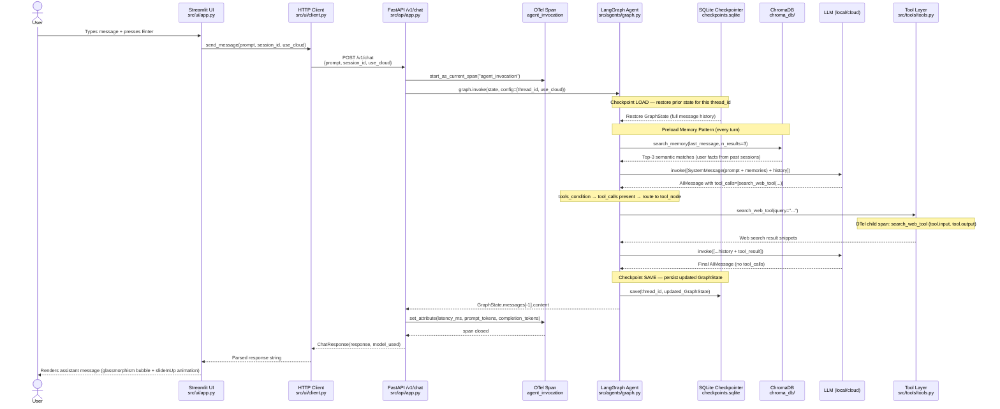
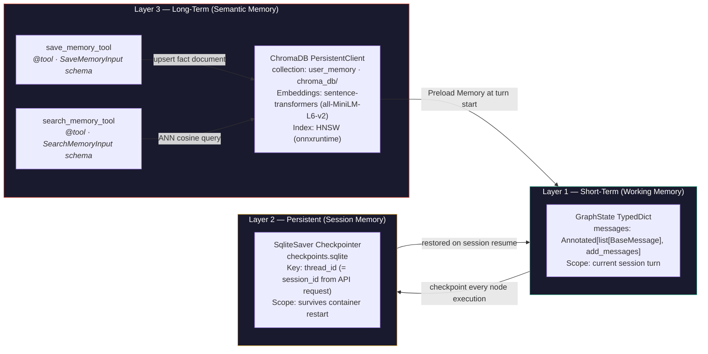
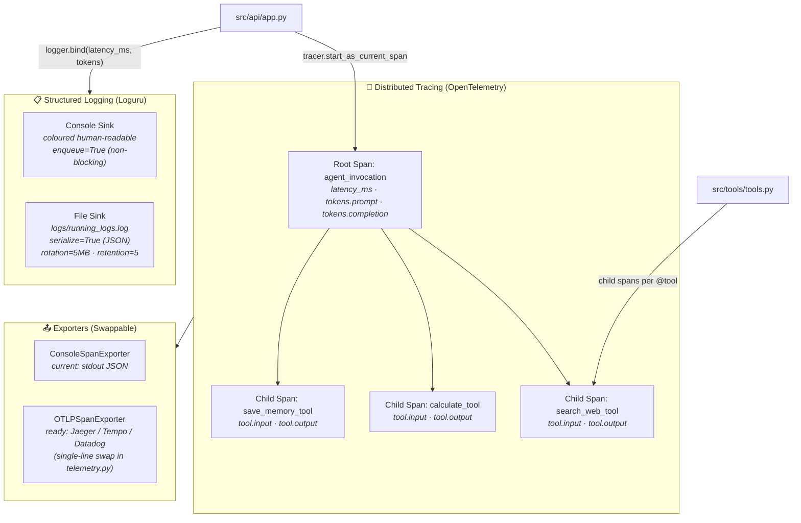
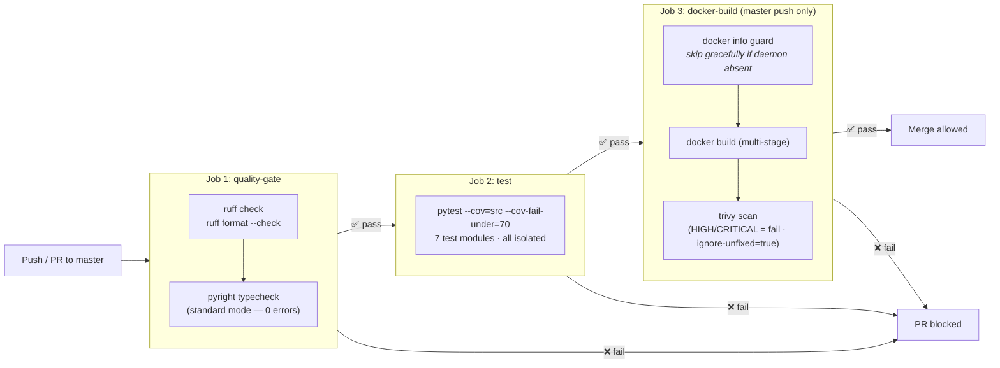
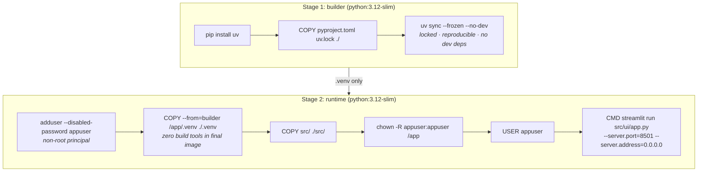

# System Architecture: AI Assistant with Persistent Memory

**Version:** 3.0.0
**Date:** 2026-04-24
**Status:** ✅ As-Built (Phases 1–3 Complete)

> This document reflects the **actual implemented state** of the system after completing all three portfolio upgrade phases. Every module path, service boundary, and data flow described here maps to production code in the repository.

---

## 1. High-Level System Overview

The system is composed of three independently deployable layers, each with a single, well-defined responsibility. The Streamlit UI is a **thin HTTP client**, it holds no agent state and no LLM instances. The FastAPI service is the **single integration point** with lifecycle-aware resource management. The LangGraph agent is where all intelligence lives.



---

## 2. Data Flow: Single Chat Turn

This diagram traces the exact execution path for a single user message from keystroke to response including the Preload Memory Pattern that executes on every turn.



---

## 3. Memory Architecture

The three memory layers serve distinct temporal scopes. They are not alternatives they all operate simultaneously on every turn.



**Scope of each layer:**

| Layer | Survives Restart? | Survives New Session? | Search Mode | Implementation |
|-------|:-----------------:|:---------------------:|-------------|----------------|
| 1 — GraphState | ❌ | ❌ | Direct read (in-process) | `add_messages` reducer |
| 2 — SQLite | ✅ | ❌ (thread_id-scoped) | Exact `thread_id` lookup | `SqliteSaver` checkpointer |
| 3 — ChromaDB | ✅ | ✅ | Semantic cosine similarity | `PersistentClient` + HNSW |

---

## 4. Module Structure (As-Built)

```mermaid
graph TD
    subgraph Root["📁 ai-assistant-docker-app/"]
        direction TB
        PC["pyproject.toml<br/><i>ruff · pyright · pytest · uv · security pins</i>"]
        DC["docker-compose.yaml<br/><i>ai-app · llm services</i>"]
        DF["Dockerfile<br/><i>multi-stage · non-root appuser</i>"]
        VS["validate_system.bat<br/><i>4-pillar local CI mirror</i>"]
        LS["launch_system.bat<br/><i>hybrid one-click launcher · --env-file</i>"]
        GH[".github/workflows/ci.yml<br/><i>3-stage GitHub Actions pipeline</i>"]
        SRC["src/"]
        TST["tests/"]
        RPT["reports/"]
    end

    SRC --> AG["agents/<br/><i>graph.py — StateGraph + ToolNode + Preload Memory<br/>memory.py — ChromaDB PersistentClient<br/>prompts.py — SYSTEM_PROMPT_V1 versioned registry</i>"]
    SRC --> AP["api/<br/><i>app.py — FastAPI lifespan + OTel spans + token metrics</i>"]
    SRC --> TL["tools/<br/><i>tools.py — 5 deterministic @tool functions with OTel spans</i>"]
    SRC --> CF["config/<br/><i>configuration.py — 3-tier priority ConfigurationManager</i>"]
    SRC --> EN["entity/<br/><i>schema.py — ChatRequest, ChatResponse, HealthResponse<br/>agent_tools.py — Pydantic input contracts for all tools</i>"]
    SRC --> UT["utils/<br/><i>logger.py — Loguru JSON + enqueued sinks<br/>telemetry.py — OTel TracerProvider + BatchSpanProcessor<br/>exceptions.py — ChatException, ModelTimeoutError</i>"]
    SRC --> UI2["ui/<br/><i>app.py — thin entry point + session state<br/>client.py — HTTP interaction layer<br/>components.py — reusable render functions<br/>styles.py — Glassmorphism CSS design system</i>"]

    TST --> T1["test_api.py<br/><i>health + chat endpoint contracts</i>"]
    TST --> T2["test_tools.py<br/><i>calculate_tool · search_web_tool isolation</i>"]
    TST --> T3["test_memory.py<br/><i>ChromaDB save/search round-trip</i>"]
    TST --> T4["test_schema.py<br/><i>Pydantic model validation</i>"]
    TST --> T5["test_configuration.py<br/><i>ConfigurationManager priority chain</i>"]
    TST --> T6["test_exceptions.py<br/><i>custom exception hierarchy</i>"]

    RPT --> DA["docs/architecture/<br/><i>system_design.md (this file)</i>"]
    RPT --> DW["docs/workflows/<br/><i>phase_1/2/3 implementation records</i>"]
    RPT --> DE["docs/evaluations/<br/><i>portfolio_upgrade_analysis.md</i>"]
    RPT --> DD["docs/decisions/<br/><i>adr-001-langgraph-vs-langchain.md</i>"]
```



---

## 5. Tool Inventory

All five tools are `@tool`-decorated functions with validated Pydantic input schemas. The LLM (Brain) selects tools; tools (Brawn) execute deterministically.

| Tool | Backing Library | Input Schema | OTel Span | Determinism |
|------|-----------------|--------------|-----------|-------------|
| `search_web_tool` | `duckduckgo-search` | `SearchWebInput(query)` | ✅ `search_web_tool` | External I/O — reproducible per query |
| `calculate_tool` | `math` + sandboxed `eval` | `CalculateInput(expression)` | ✅ `calculate_tool` | 100% deterministic |
| `summarize_document_tool` | `langchain-text-splitters` | `SummarizeDocumentInput(text, query)` | ✅ `summarize_document_tool` | Deterministic chunking + term-overlap |
| `save_memory_tool` | ChromaDB write | `SaveMemoryInput(fact)` | ✅ `save_memory_tool` | Deterministic write |
| `search_memory_tool` | ChromaDB ANN | `SearchMemoryInput(query)` | ✅ `search_memory_tool` | Deterministic vector query |

---

## 6. Observability Architecture

Two modules provide layered observability: structured JSON logging for human/machine audit trails, and distributed tracing for causal tool-call attribution.



**Log fields available per request (JSON file sink):**
- `time`, `level`, `name`, `message` — standard Loguru fields
- `prompt_tokens`, `completion_tokens` — extracted from LangChain response metadata
- `latency_ms` — wall-clock time from request receipt to graph completion

---

## 7. CI/CD Pipeline



**Security hardening in pipeline:**
- `pillow>=12.2.0` — explicit pin to resolve CVE-2026-40192
- `urllib3>=2.6.3` — resolves CVE-2026-21441 decompression-bomb bypass
- `protobuf>=5.29.1` — upgraded to 5.x / 6.x series compatible with `streamlit>=1.40.0`
- `trivy` `ignore-unfixed: true` — only fails on vulnerabilities with available patches

---

## 8. Docker Build Architecture



**Layer cache strategy:** `pyproject.toml` + `uv.lock` are copied before source. Docker only re-runs `uv sync` when dependencies change. Source file edits (`COPY src/`) do not invalidate the dependency layer, but the iterative rebuilds take seconds, not minutes.

---

## 9. UI Architecture (src/ui/)

The frontend is a four-module package applying the Single Responsibility Principle to the Streamlit layer:

| Module | Responsibility | Key Design |
|--------|----------------|------------|
| `app.py` | Session state init, top-level layout | Thin entry point — no business logic |
| `client.py` | All HTTP interaction with FastAPI backend | `requests.post` + error handling isolated here |
| `components.py` | Reusable render functions | `render_chat_history()`, sidebar, demo buttons |
| `styles.py` | CSS design system | Glassmorphism, Google Fonts (Inter/Outfit), micro-animations |

**Design tokens implemented in `styles.py`:**
- Glassmorphism: `backdrop-filter: blur(10px)` on chat message containers
- Typography: `@import` of `Inter` and `Outfit` from Google Fonts
- Color palette: HSL-tuned indigo-to-purple gradient (`hsl(250, 80%, 55%)` → `hsl(280, 75%, 50%)`)
- Animation: `@keyframes slideInUp` on chat bubble entry
- Custom scrollbar consistent with dark-mode color token system

---

## 10. Key Design Decisions

| Decision | Choice | Rationale |
|----------|--------|-----------|
| Agent orchestration | LangGraph `StateGraph` | Native `ToolNode`, `tools_condition`, SQLite checkpointing, graph-based routing |
| Layer 2 persistence | `SqliteSaver` | Zero-config dev; swappable to `AsyncPostgresSaver` for production with no agent code changes |
| Layer 3 persistence | ChromaDB `PersistentClient` | Embeddable in Docker, semantic ANN search, no external vector service required |
| Embedding engine | `sentence-transformers` + `onnxruntime` | Pinned in `pyproject.toml`; avoids silent runtime download failures that broke Layer 3 silently |
| API framework | FastAPI + `lifespan()` | Singleton graph construction, ASGI3-compliant teardown, Pydantic auto-validation |
| Type checking | `pyright` (standard mode) | Superior Pydantic v2 inference, faster incremental analysis vs. mypy |
| Container strategy | Multi-stage Dockerfile | Layer cache for dev velocity, non-root user, minimal attack surface |
| UI decoupling | `src/ui/` package (4 modules) | SRP applied to frontend; HTTP client isolated in `client.py`, design system in `styles.py` |
| Logging | Loguru (`enqueue=True`, `serialize=True`) | Non-blocking async queue; JSON file sink directly ingestible by log aggregators |
| Tracing | OpenTelemetry `BatchSpanProcessor` | Swappable exporter (Console → OTLP); two-layer span hierarchy per request |
| Config resolution | 3-tier priority chain | Prevents host env var leakage into Docker container (Docker-injected → explicit env → YAML defaults) |
| Dependency management | `uv sync --frozen` | Bit-for-bit reproducible environments across all developers and CI runners |

---

## 11. Validated System State

All acceptance criteria across Phases 1–3 were verified end-to-end:

```
Phase 1 — Foundation Hardening
✅ docker-compose up --build  →  Services started (backend:8000, frontend:8501)
✅ GET /v1/health             →  {"status": "ok"}
✅ POST /v1/chat (local)      →  Routed to ai/devstral-small-2 via Docker Model Runner
✅ POST /v1/chat (cloud)      →  Routed to OpenRouter (google/gemma-3-27b-it) — 200 OK
✅ Session persistence        →  thread_id maintained across requests via checkpoints.sqlite
✅ pyright                    →  Standard mode — 0 errors
✅ ruff check                 →  0 violations

Phase 2 — Agentic Upgrade
✅ Tool calling               →  search_web_tool, calculate_tool verified in agent responses
✅ save_memory_tool           →  Facts written to chroma_db/user_memory collection
✅ search_memory_tool         →  Facts retrieved cross-session via ANN query
✅ Preload Memory             →  Relevant facts injected into SystemMessage per turn
✅ "What do you remember?"   →  UI button fires memory query — demo-ready
✅ Prompt registry            →  SYSTEM_PROMPT_V1 + ACTIVE_SYSTEM_PROMPT wired in prompts.py

Phase 3 — Production Engineering
✅ Lifespan context manager   →  "Agent Graph initialized." on startup; singleton pattern
✅ GET /v1/health             →  {"status": "healthy", "model": "<active>", "memory_backend": "SQLite + ChromaDB"}
✅ OTel spans                 →  agent_invocation + tool child spans visible in stdout
✅ Token logging              →  prompt_tokens, completion_tokens, latency_ms in JSON log
✅ validate_system.bat        →  All 4 pillars passing (Pyright, Ruff, pytest ≥ 70%, ports)
✅ launch_system.bat          →  Single browser tab, API in separate window, no 401 errors
✅ Docker daemon guard        →  Pillar 3 skipped gracefully when Docker is not running
✅ src/ui/ package            →  4-module SRP frontend — glassmorphism UI rendering correctly
✅ Memory logs                →  save_memory + search_memory emit INFO lines to running_logs.log
✅ Embedding engine           →  sentence-transformers + onnxruntime pinned; no runtime downloads
✅ GitHub Actions pipeline    →  3-stage CI passing on master (quality-gate → test → docker-build)
✅ Trivy scan                 →  pillow/urllib3/protobuf security pins resolve HIGH/CRITICAL CVEs
```
