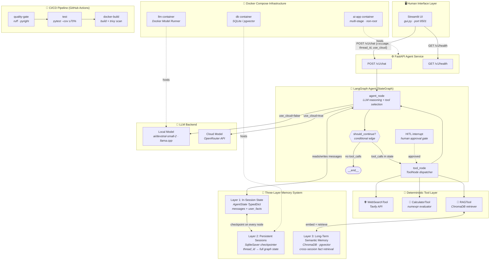
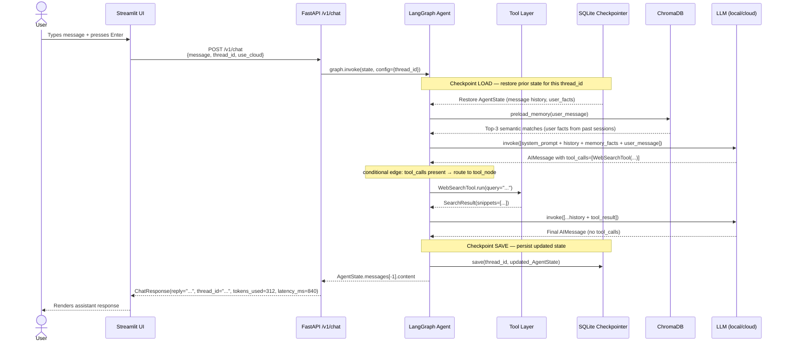
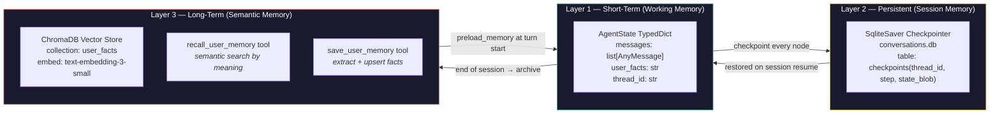
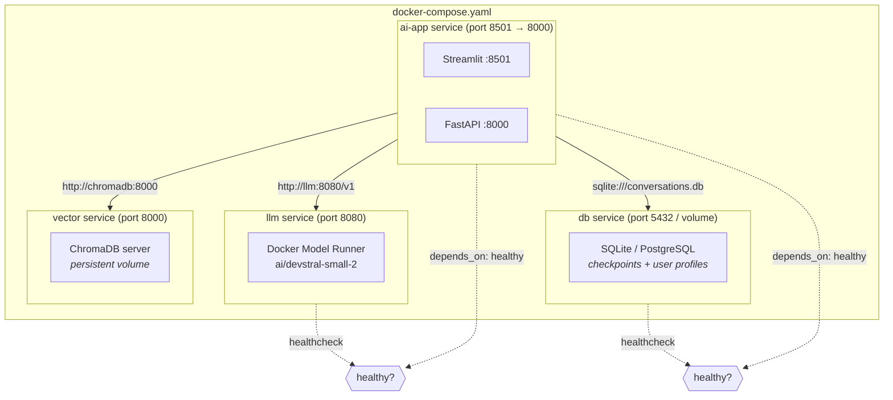
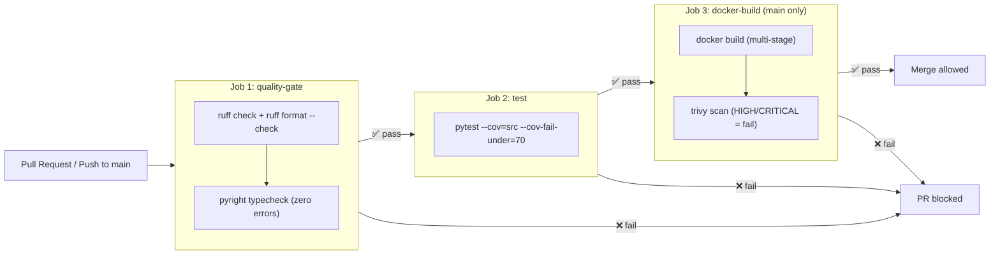

# System Architecture: AI Assistant with Persistent Memory

**Version:** 1.0.0  
**Date:** 2026-04-20  
**Status:** Target State (Post-Upgrade)

---

## 1. High-Level System Overview

The system is comprised of three independently deployable layers, each with a single, well-defined responsibility. The Streamlit UI is a **dumb client**, it knows nothing about the agent or memory. The FastAPI service is the **single integration point**. The LangGraph agent is where all intelligence lives.

---

## 2. Data Flow: Single Chat Turn

This diagram traces the exact execution path for a single user message, from keystroke to response.

---

## 3. Memory Architecture Detail

The three memory layers serve distinct temporal scopes. They are not alternatives, all three operate simultaneously on every turn.

**Scope of each layer:**

| Layer | Survives Restart? | Survives New Session? | Search Mode |
|-------|:-----------------:|:---------------------:|-------------|
| 1 — AgentState | ❌ | ❌ | N/A (direct read) |
| 2 — SQLite | ✅ | ❌ (thread_id-scoped) | Exact thread_id lookup |
| 3 — ChromaDB | ✅ | ✅ | Semantic (cosine similarity) |

---

## 4. Module Structure

```mermaid
graph TD
    subgraph Root["📁 ai-assistant-docker-app/"]
        direction TB
        PC["pyproject.toml<br/><i>ruff · pyright · pytest · uv</i>"]
        DC["docker-compose.yaml<br/><i>ai-app · llm · db services</i>"]
        DF["Dockerfile<br/><i>multi-stage · non-root</i>"]
        CP2["config/"]
        SRC["src/"]
        TST["tests/"]
        RPT["reports/"]
    end

    CP2 --> CY["config.yaml<br/><i>paths</i>"]
    CP2 --> PY["params.yaml<br/><i>model params</i>"]
    CP2 --> PR["prompts.yaml<br/><i>versioned system prompts</i>"]

    SRC --> AG["agents/<br/><i>graph.py — StateGraph definition</i>"]
    SRC --> AP["api/<br/><i>main.py — FastAPI app<br/>routes/chat.py, routes/health.py</i>"]
    SRC --> TL["tools/<br/><i>web_search.py<br/>calculator.py<br/>rag_retriever.py<br/>memory_tools.py</i>"]
    SRC --> CF["config/<br/><i>configuration.py — ConfigurationManager</i>"]
    SRC --> EN["entity/<br/><i>schemas.py — ChatRequest, ChatResponse, AgentState</i>"]
    SRC --> UT["utils/<br/><i>logger.py · exceptions.py</i>"]
    SRC --> UI2["ui/<br/><i>gui.py — Streamlit client</i>"]

    TST --> UT2["tests/tools/<br/><i>test_calculator.py<br/>test_web_search.py</i>"]
    TST --> UA["tests/api/<br/><i>test_health.py<br/>test_chat_endpoint.py</i>"]
    TST --> UM["tests/memory/<br/><i>test_sqlite_saver.py<br/>test_chromadb.py</i>"]

    RPT --> DA["docs/architecture/<br/><i>system_design.md (this file)</i>"]
    RPT --> DD["docs/decisions/<br/><i>adr-001-langgraph-vs-langchain.md</i>"]
```

---

## 5. Docker Compose Service Topology

---

## 6. CI/CD Pipeline

---

## 7. Key Design Decisions

| Decision | Choice | Rationale |
|----------|--------|-----------|
| Agent orchestration | LangGraph StateGraph | Native HITL, checkpointing, graph-based routing |
| Persistence (L2) | SqliteSaver (dev) / AsyncPostgresSaver (prod) | Zero-config locally; production-grade swap |
| Persistence (L3) | ChromaDB | Embeddable in Docker; semantic search; no cloud dependency |
| API framework | FastAPI | Typed Pydantic schemas, async, OpenAPI docs auto-generated |
| Type checking | pyright (standard) | Superior Pydantic v2 inference vs mypy |
| Container strategy | Multi-stage Dockerfile | Layer cache optimization, non-root user, minimal attack surface |
| UI framework | Streamlit (thin client only) | Rapid prototyping; all logic is in FastAPI — UI is replaceable |
