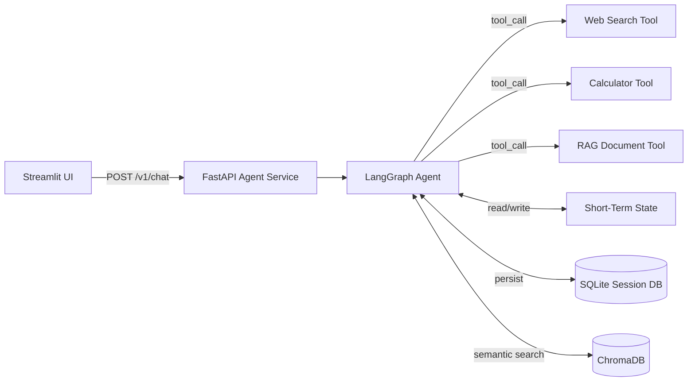

# Portfolio Upgrade Analysis: AI Assistant Docker App → Elite-Grade Agentic System

---

## What You Have Now (Honest Diagnosis)

The current app is a **well-intentioned prototype**, but it reads as a beginner-to-intermediate project to a senior hiring panel. Here's a clinical breakdown:

| Dimension | Current State | Elite Bar |
|---|---|---|
| **Architecture** | God-class `AIChatApp` monolith | Modular FTI-style separation of concerns |
| **Memory** | Ephemeral `ConversationBufferMemory` (cleared on restart) | 3-layer: in-session → DB → semantic vector store |
| **Agent Design** | None — it's a *chat wrapper*, not an agent | Tool-calling agent with structured tool definitions |
| **API Layer** | No FastAPI service — Streamlit calls the LLM directly | Decoupled FastAPI microservice (`/v1/chat`, `/v1/health`) |
| **Type Safety** | Untyped `Dict[str, str]`, no Pydantic models | Full Pydantic v2 schemas, `pyright` passing |
| **Config** | `os.environ.get()` sprints scattered in a class | `config.yaml` → frozen dataclass → injected via `ConfigurationManager` |
| **System Prompts** | None — no personality, no versioning | Versioned, templated system prompts in `config/prompts.yaml` |
| **Docker** | Single-stage, copies everything, `pip install uv` antipattern | Multi-stage build, pinned digest, non-root user, `.dockerignore` hardened |
| **CI/CD** | None | GitHub Actions: lint → typecheck → test → build → scan |
| **Tests** | None | pytest unit tests for tools, LLM-as-a-Judge evals for agent |
| **Observability** | Basic `logging.basicConfig` | Structured logging + OpenTelemetry tracing on every inference call |
| **Toolchain** | bare `pyproject.toml` (no ruff, no pyright config) | Full scaffold: ruff, pyright, pytest, coverage |
| **README** | Present | Architecture diagram, Mermaid flow, one-copy deploy instructions |

> [!CAUTION]
> The most damaging gap: **there is no agent**. `ConversationChain` with `ConversationBufferMemory` is a deprecated LangChain v0.1 pattern. A senior reviewer will immediately recognize this is pre-2024 boilerplate — not an agentic system.

---

## The North Star: What This Project *Should* Demonstrate

To stand out to elite employers (staff-level ML engineers, AI architects, technical VPs), the project must prove you can:

1. **Design a real agentic system** — not just call an LLM API and display the output
2. **Apply production engineering discipline** to AI — typing, testing, tracing, CI/CD
3. **Make intelligent architectural tradeoffs** — and articulate *why* in the README and ADRs
4. **Close the production gap** — bridge from notebook to containerized, observable, cloud-deployable service

---

## Phase-by-Phase Upgrade Roadmap

### 🔴 Phase 1 — Foundation Hardening (Non-negotiable before anything else)

**Goal:** Make the codebase defensible to a senior code reviewer.

#### 1.1 — Refactor `app.py` into Proper Module Structure
Stop the God-class. Implement the project skeleton:

```
src/
├── agents/          ← LangGraph agent graph lives here
├── api/             ← FastAPI app with /v1/chat, /v1/health
├── config/          ← ConfigurationManager (YAML → frozen dataclass)
├── entity/          ← Pydantic request/response schemas
├── tools/           ← Deterministic tool functions
├── utils/
│   ├── logger.py    ← Rich + RotatingFileHandler
│   └── exceptions.py ← ChatException, ModelTimeoutError
```

#### 1.2 — Wire the Full `pyproject.toml` Scaffold
Currently the `pyproject.toml` has zero tooling config. this is a violation:

```toml
[tool.pyright]
pythonVersion = "3.12"
typeCheckingMode = "standard"

[tool.ruff.lint]
select = ["E", "F", "I", "UP", "N", "W", "B", "SIM", "C4", "RUF"]

[tool.pytest.ini_options]
testpaths = ["tests"]
```

Add: `.pre-commit-config.yaml`, `.env.example`, `src/py.typed`

#### 1.3 — Harden the Dockerfile
the current Dockerfile has 4 production violations:
- No multi-stage build → bloated image
- `pip install uv` in an image that will be rebuilt constantly → slow
- No non-root user → security risk
- `COPY . .` before dependency install → destroys layer cache

```dockerfile
# Stage 1: builder
FROM python:3.12-slim AS builder
RUN pip install uv
WORKDIR /app
COPY pyproject.toml uv.lock ./
RUN uv sync --frozen --no-dev

# Stage 2: runtime
FROM python:3.12-slim AS runtime
RUN adduser --disabled-password appuser
WORKDIR /app
COPY --from=builder /app/.venv ./.venv
COPY src/ ./src/
COPY config/ ./config/
USER appuser
```

---

### 🟡 Phase 2 — The Agentic Upgrade (The Core Portfolio Signal)

**Goal:** Transform from a chat wrapper into a real, demonstrable agentic system.

#### 2.1 — Introduce a Real Agent with Tools

Replace `ConversationChain` with a LangGraph `StateGraph` agent. Give the agent at least **3 deterministic tools** that showcase the Brain/Brawn divide:

| Tool | Type | What It Proves |
|---|---|---|
| `search_web_tool` | External API (e.g., Tavily/DuckDuckGo) | Agent can gather real-world context |
| `calculate_tool` | Deterministic math evaluator | You understand LLMs shouldn't do math |
| `summarize_document_tool` | Text chunking + embedding retrieval (RAG) | You understand retrieval-augmented generation |

Every tool MUST use a Pydantic `BaseModel` input schema and a Google-style docstring (the agent reads these to know when to call the tool).

#### 2.2 — Three-Layer Memory Architecture

This is the single most impressive upgrade you can make to this specific app:

| Layer | Implementation | Showcase |
|---|---|---|
| **Short-term** | LangGraph `StateGraph` with checkpointer | Conversation context within a session |
| **Persistent** | SQLite/PostgreSQL session DB via `SqliteSaver`/`AsyncPostgresSaver` | Memory survives container restart |
| **Long-term** | ChromaDB or pgvector — semantic search over past conversations | Agent recalls facts from 3 sessions ago |

In the UI, add a **"What do you remember about me?"** demo button. This is a jaw-dropping live demo moment that makes the three-layer architecture tangible to a non-technical interviewer.

#### 2.3 — Structured System Prompts

Move the system prompt out of the code entirely:

```yaml
# config/prompts.yaml
system_prompt:
  version: "1.2.0"
  template: |
    You are a helpful AI assistant with persistent memory.
    You have access to tools: {tool_names}.
    Today's date is {current_date}.
    Known user facts: {user_facts}
```

Load via `ConfigurationManager`. Version-control prompt changes the same way you version model artifacts.

---

### 🟢 Phase 3 — Production Engineering Layer (What Separates Junior from Senior)

**Goal:** Wrap the system in production-grade observability and CI/CD.

#### 3.1 — FastAPI Decoupling

Extract the agent into a `FastAPI` microservice. The Streamlit UI becomes a thin client:

```
Streamlit UI  →  POST /v1/chat  →  FastAPI Agent Service  →  LLM + Tools
                 GET  /v1/health                               ↓
                                                          LangGraph State
```

Every endpoint needs:
- Versioned prefix (`/v1/`)
- Pydantic request (`ChatRequest`) and response (`ChatResponse`) models
- `GET /v1/health` returning `{"status": "healthy", "model": "...", "memory_backend": "..."}`
- Lifespan context manager for agent initialization (never inside handler)

This makes the entire system diagrams-friendly and interview-ready.

#### 3.2 — GitHub Actions CI/CD Pipeline

Three-stage pipeline:

```yaml
# .github/workflows/ci.yml
jobs:
  quality-gate:    # ruff lint + pyright typecheck
  test:            # pytest --cov=src --cov-fail-under=70
  docker-build:    # docker build + trivy scan (on push to main)
```

The badge on the README (`✅ CI passing`) is the first thing a recruiter sees.

#### 3.3 — Structured Observability

Replace `logging.basicConfig` with:
- **Structured logging**: `structlog` or `loguru` with JSON output
- **OpenTelemetry tracing**: Wrap every agent invocation and tool call in a span
- **Token usage tracking**: Log `prompt_tokens`, `completion_tokens`, `latency_ms` per request — this is the AgentOps metric layer.

---

### 🔵 Phase 4 — Documentation as Portfolio Artifact

**Goal:** The README and `reports/` directory become a technical interview cheat sheet.

#### 4.1 — Architecture Document

Create `reports/docs/architecture/system_design.md` with a Mermaid system diagram:



#### 4.2 — ADR (Architectural Decision Record)

Write `reports/docs/decisions/adr-001-langgraph-vs-langchain.md`:
> *"We chose LangGraph over bare LangChain chains because it provides explicit state management, native HITL interrupt support, and time-travel debugging — critical for a persistent-memory agentic system."*

**This single ADR document, shown in an interview, demonstrates systems-thinking maturity that 90% of ML candidates lack.**

#### 4.3 — README Upgrade

The README should be a portfolio landing page, not an afterthought. It needs:
- An architecture diagram (Mermaid or image)
- A **Why this is hard** section explaining the design tradeoffs
- A Quick Start (`docker compose up`) with expected output
- CI badge + Docker image size badge
- A live demo GIF (record the UI with memory working)

---

## Priority Matrix

```
Impact on Elite Employers vs. Effort Required:
┌──────────────────────────────────────────────────────────────┐
│  HIGH IMPACT                                                 │
│  ┌─────────────────────────────────────────────────────┐     │
│  │  🔴 LangGraph Agent (Phase 2.1)   HIGH EFFORT       │     │
│  │  🔴 3-Layer Memory (Phase 2.2)    HIGH EFFORT       │     │
│  │  🟢 FastAPI Decoupling (Phase 3.1) MEDIUM EFFORT    │     │
│  │  🟢 GitHub Actions CI (Phase 3.2) LOW EFFORT        │     │
│  │  🔵 README + ADR (Phase 4)        LOW EFFORT        │     │
│  └─────────────────────────────────────────────────────┘     │
│  ┌─────────────────────────────────────────────────────┐     │
│  │  🟡 PyProject tooling (Phase 1.2) LOW EFFORT        │     │
│  │  🟡 Dockerfile hardening (Phase 1.3) LOW EFFORT     │     │
│  └─────────────────────────────────────────────────────┘     │
│  LOW IMPACT (foundational hygiene only)                      │
└──────────────────────────────────────────────────────────────┘
```

---

## The One Paragraph You Should Be Able to Say in an Interview

> *"This system demonstrates a production-grade agentic architecture: a LangGraph `StateGraph` orchestrates a multi-tool agent with three layers of memory — ephemeral in-session state, SQLite-backed persistent sessions across restarts, and a semantic ChromaDB vector store for long-term user fact retrieval. The agent is exposed via a versioned FastAPI microservice (`/v1/chat`), decoupled from the Streamlit UI, with OpenTelemetry tracing on every tool invocation. The full stack runs in a multi-stage Docker container, deployed via a three-stage GitHub Actions pipeline that enforces `pyright` type checking, 70% test coverage, and a Trivy container scan before any merge to main."*

That paragraph contains 8 distinct production engineering signals. Most ML candidates can speak to 2 or 3.

---

## What NOT to Add (Common Portfolio Mistakes)

- ❌ **Kubernetes** — Overkill for a single-service app. Screams cargo-culting if you can't explain it end-to-end.
- ❌ **Celery/Redis task queue** — No async work to justify it.
- ❌ **Fine-tuning** — Irrelevant to this app's purpose; adds scope without depth.
- ❌ **More LLM providers** — More breadth ≠ more depth. Depth wins.
- ❌ **A second identical app** — One excellent project beats three mediocre ones.
