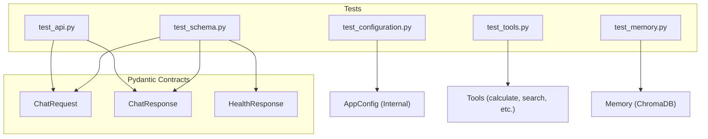

# Test Suite Architecture — Runbook

## 1. Purpose

This document describes the project's unit testing strategy, establishing the first tier of the **Testing Pyramid** for the AI Assistant.

> **Testing Pyramid Layer 1 (Pytest):** Strictly for **Tools, Memory, Config and API Schemas**.
> Ensures the deterministic foundation of the agentic system works 100% of the time. Tests are fast, isolated, and use mocking for external dependencies via a centralized `conftest.py`.

---

## 2. Testing Philosophy: What We Test (and What We Don't)

| Layer | Responsible For | Tool |
|---|---|---|
| **Unit Tests (pytest)** | API Endpoints, Configuration loading, Data Schemas, Utility Logic | `pytest` |
| **Agentic Evals** | LangGraph flow accuracy, Tool calling precision | LangSmith / Evals (Future) |
| **Infrastructure** | Container health, Docker multi-stage integrity | Docker Healthchecks |

**We do NOT test LLM reasoning in unit tests.** The LLM is probabilistic; instead, we test the **rigid contracts** around it — the Pydantic schemas that validate the inputs Sent to and outputs Received from the agent. All tests run against mocked agent graphs to ensure deterministic results.

---

## 3. Test Files

### 3.1 `tests/test_api.py` — FastAPI Integration
**Purpose:** Validates the REST API boundary, ensuring endpoints respond correctly and handle agent failures gracefully.

| Test | Component Tested | What It Proves |
|---|---|---|
| `test_health_check` | `GET /v1/health` | The API is alive and returns the correct status schema. |
| `test_chat_endpoint_success` | `POST /v1/chat` | Valid requests (with `X-API-Key`) are correctly routed to the LangGraph agent and mapped to `ChatResponse`. |
| `test_chat_endpoint_failure` | `POST /v1/chat` | Agent-level exceptions are caught and returned as clean `500` errors without leaking stack traces. |

### 3.2 `tests/test_configuration.py` — Config Management
**Purpose:** Validates that the `ConfigurationManager` correctly hydrates settings with proper precedence.

| Test | What It Proves |
|---|---|
| `test_configuration_loads_from_env_vars` | Environment variables correctly override YAML defaults (Twelve-Factor App compliance). |
| `test_configuration_defaults` | The system falls back to safe defaults (e.g., `ai/devstral-small-2`) if no config/env is provided. |

### 3.3 `tests/test_schema.py` — Data Contracts (Pydantic)
**Purpose:** Ensures strict data validation for all API inputs and outputs.

| Test | Schema Tested | Constraint Enforced |
|---|---|---|
| `test_chat_request_valid` | `ChatRequest` | Accepts valid prompt/session payloads. |
| `test_chat_request_missing_prompt` | `ChatRequest` | Triggers `ValidationError` if the prompt is missing. |
| `test_chat_request_defaults` | `ChatRequest` | Correctly assigns a **UUID** `session_id` and `use_cloud=False`. |

### 3.4 `tests/test_exceptions.py` — Error Handling
**Purpose:** Validates the custom exception hierarchy and diagnostic formatting.

| Test | Component Tested | What It Proves |
|---|---|---|
| `test_custom_exceptions_inheritance` | `ChatException` | Custom errors inherit from a common base for global catching. |
| `test_error_message_detail` | `error_message_detail` | The utility accurately extracts filename and line number from a Python traceback. |

### 3.5 `tests/test_tools.py` — Agentic Tools
**Purpose:** Verifies the deterministic behavior of the mathematical, web search, and memory-related tools.

| Test | Component Tested | What It Proves |
|---|---|---|
| `test_calculate_tool` | `calculate_tool` | Accurately evaluates math expressions using `simpleeval`. |
| `test_search_web_tool` | `search_web_tool` | Correctly parses and formats DuckDuckGo search results. |
| `test_save_memory_tool` | `save_memory_tool` | Reports success/failure of fact persistence correctly. |

### 3.6 `tests/test_memory.py` — Long-Term Memory
**Purpose:** Validates the persistence and retrieval of user facts from the vector store.

| Test | Component Tested | What It Proves |
|---|---|---|
| `test_save_memory` | `save_memory` | Facts are correctly passed to the vector collection for persistence. |
| `test_search_memory` | `search_memory` | Semantic search handles empty states and returns results correctly. |

### 3.7 `tests/conftest.py` — Test Infrastructure
**Purpose:** Centralizes shared fixtures and mocks to ensure tests are fast and isolated.

- **Mock Agent Graph:** Prevents real LLM calls and DB side effects.
- **OTel Tracer Stub:** Prevents telemetry exports during testing.
- **Mock Config:** Provides controlled environment variables for predictable loading.

---

## 4. Test Execution

```bash
# Run the full test suite
uv run pytest

# Run with verbose output
uv run pytest -v
```

---

## 5. Test Results Summary

| Test Module | Passed | Failed | Result |
|---|---|---|---|
| `tests/test_api.py` | 3 | 0 | **PASS** ✅ |
| `tests/test_configuration.py` | 2 | 0 | **PASS** ✅ |
| `tests/test_exceptions.py` | 2 | 0 | **PASS** ✅ |
| `tests/test_memory.py` | 2 | 0 | **PASS** ✅ |
| `tests/test_schema.py` | 5 | 0 | **PASS** ✅ |
| `tests/test_tools.py` | 5 | 0 | **PASS** ✅ |
| **TOTAL** | **19** | **0** | **PASS** ✅ |

```
tests\test_api.py ...                                                    [ 15%]
tests\test_configuration.py ..                                           [ 26%]
tests\test_exceptions.py ..                                              [ 36%]
tests\test_memory.py ..                                                  [ 47%]
tests\test_schema.py .....                                               [ 73%]
tests\test_tools.py .....                                                [100%]

============================= 19 passed in 12.31s =============================
```

---

## 6. Schema Contract Coverage Map



---

## 7. CI/CD Gate

The test suite is designed to be the primary gateway for the CI/CD pipeline. The build will fail if:
1. Any `pytest` unit test fails.
2. `ruff` linting/formatting checks fail.
3. `pyright` type checking finds violations (80%+ coverage target).
