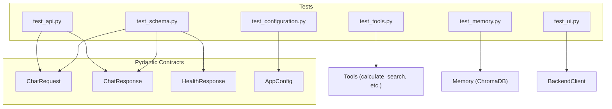

# Test Suite Architecture — Runbook

## 1. Purpose

This document describes the project's unit testing strategy, establishing the first tier of the **Testing Pyramid** for the AI Assistant.

> **Testing Pyramid Layer 1 (Pytest):** Strictly for **Tools, Memory, Config and API Schemas**.
> Ensures the deterministic foundation of the agentic system works 100% of the time. Tests are fast, isolated, and use mocking for external dependencies via a centralized `conftest.py`.

---

## 2. Testing Philosophy: What We Test (and What We Don't)

| Layer | Responsible For | Tool |
|---|---|---|
| **Unit Tests (pytest)** | API Endpoints, Configuration loading, Data Schemas, Utility Logic, UI Components | `pytest` |
| **Agentic Evals** | LangGraph flow accuracy, Tool calling precision | LangSmith / Evals (Future) |
| **Infrastructure** | Container health, Docker multi-stage integrity | Docker `HEALTHCHECK` directive |

**We do NOT test LLM reasoning in unit tests.** The LLM is probabilistic; instead, we test the **rigid contracts** around it — the Pydantic schemas that validate the inputs sent to and outputs received from the agent. All tests run against mocked agent graphs to ensure deterministic results.

---

## 3. Test Files

### 3.1 `tests/test_api.py` — FastAPI Integration
**Purpose:** Validates the REST API boundary, ensuring endpoints respond correctly and handle agent failures gracefully.

| Test | Component Tested | What It Proves |
|---|---|---|
| `test_health_check` | `GET /v1/health` | The API is alive and returns the correct status schema. |
| `test_chat_endpoint_success` | `POST /v1/chat` | Valid requests (with `X-API-Key`) are correctly routed to the LangGraph agent and mapped to `ChatResponse`. |
| `test_chat_endpoint_failure` | `POST /v1/chat` | Agent-level exceptions are caught and returned as clean `500` errors without leaking stack traces. |

### 3.2 `tests/test_configuration.py` — Config Management
**Purpose:** Validates that the `ConfigurationManager` correctly hydrates all settings with proper precedence, including the Phase 5 additions (`checkpoint_db_path`, `chroma_db_path`, `hitl_enabled`).

| Test | What It Proves |
|---|---|
| `test_configuration_loads_from_env_vars` | Environment variables correctly override YAML defaults (Twelve-Factor App compliance). |
| `test_configuration_defaults` | The system falls back to safe defaults (e.g., `ai/devstral-small-2`) if no config/env is provided. |

### 3.3 `tests/test_schema.py` — Data Contracts (Pydantic)
**Purpose:** Ensures strict data validation for all API inputs and outputs.

| Test | Schema Tested | Constraint Enforced |
|---|---|---|
| `test_chat_request_valid` | `ChatRequest` | Accepts valid prompt/session payloads. |
| `test_chat_request_missing_prompt` | `ChatRequest` | Triggers `ValidationError` if the prompt is missing. |
| `test_chat_request_defaults` | `ChatRequest` | Correctly assigns a **UUID** `session_id` and `use_cloud=False`. |

### 3.4 `tests/test_exceptions.py` — Error Handling
**Purpose:** Validates the custom exception hierarchy.

| Test | Component Tested | What It Proves |
|---|---|---|
| `test_custom_exceptions_inheritance` | `ChatException` | Custom errors inherit from a common base for global catching. |

> **Note (v1.4):** `error_message_detail()` was purged as dead code. Its test was removed accordingly. The global FastAPI exception handler now owns all sanitized error formatting.

### 3.5 `tests/test_tools.py` — Agentic Tools
**Purpose:** Verifies the deterministic behavior of the mathematical, web search, and memory-related tools.

| Test | Component Tested | What It Proves |
|---|---|---|
| `test_calculate_tool` | `calculate_tool` | Accurately evaluates math expressions using `simpleeval`. |
| `test_search_web_tool` | `search_web_tool` | Correctly parses and formats DuckDuckGo search results. |
| `test_save_memory_tool` | `save_memory_tool` | Reports success/failure of fact persistence correctly. |

### 3.6 `tests/test_memory.py` — Long-Term Memory
**Purpose:** Validates the ChromaDB-backed semantic memory layer (Layer 3 of the 3-Layer Memory Architecture).

| Test | Component Tested | What It Proves |
|---|---|---|
| `test_save_and_search_memory` | `save_memory` / `search_memory` | Facts written to ChromaDB are correctly retrieved by semantic query. |
| `test_search_memory_empty` | `search_memory` | Returns an empty list gracefully when the collection has no entries. |

### 3.7 `tests/test_ui.py` — UI Layer
**Purpose:** Validates the Streamlit frontend logic, session initialization, and backend client communication.

| Test | Component Tested | What It Proves |
|---|---|---|
| `test_send_chat_message_success` | `BackendClient` | Successful payload delivery and response parsing from the API. |
| `test_send_chat_message_error` | `BackendClient` | Graceful handling of connection errors or API failures. |
| `test_initialize_session_new` | `initialize_session` | Correct creation of `session_id` (UUID) and `messages` list on first run. |
| `test_initialize_session_existing` | `initialize_session` | Idempotency — ensures existing sessions are not overwritten. |
| `test_render_demo_actions_no_click` | `render_demo_actions` | Returns `None` when no demo button is interacted with. |
| `test_render_demo_actions_memory_click` | `render_demo_actions` | Returns the correct search prompt when the memory demo is triggered. |

### 3.8 `tests/conftest.py` — Test Infrastructure
**Purpose:** Centralizes shared fixtures and mocks to ensure tests are fast and isolated.

- **Mock Agent Graph:** Prevents real LLM calls and DB side effects.
- **OTel Tracer Stub:** Prevents telemetry exports during testing.
- **Mock Config:** Provides controlled environment variables for predictable loading, including all Phase 5 fields (`checkpoint_db_path=":memory:"`, `chroma_db_path`, `hitl_enabled=False`).

---

## 4. Test Execution

```bash
# Run the full test suite
uv run pytest

# Run with verbose output
uv run pytest -v

# Run with coverage report
uv run pytest --cov=src --cov-fail-under=70
```

---

## 5. Test Results Summary

| Test Module | Tests | Passed | Failed | Result |
|---|---|---|---|---|
| `tests/test_api.py` | 3 | 3 | 0 | **PASS** ✅ |
| `tests/test_configuration.py` | 2 | 2 | 0 | **PASS** ✅ |
| `tests/test_exceptions.py` | 1 | 1 | 0 | **PASS** ✅ |
| `tests/test_memory.py` | 2 | 2 | 0 | **PASS** ✅ |
| `tests/test_schema.py` | 5 | 5 | 0 | **PASS** ✅ |
| `tests/test_tools.py` | 5 | 5 | 0 | **PASS** ✅ |
| `tests/test_ui.py` | 6 | 6 | 0 | **PASS** ✅ |
| **TOTAL** | **24** | **24** | **0** | **PASS** ✅ |

```
tests\test_api.py ...                                                        [ 12%]
tests\test_configuration.py ..                                               [ 20%]
tests\test_exceptions.py .                                                   [ 25%]
tests\test_memory.py ..                                                      [ 33%]
tests\test_schema.py .....                                                   [ 54%]
tests\test_tools.py .....                                                    [ 75%]
tests\test_ui.py ......                                                      [100%]

================================= tests coverage ==================================

Name                          Stmts   Miss  Cover
-------------------------------------------------
src\agents\graph.py              67     42    37%
src\agents\memory.py             37      3    92%
src\agents\prompts.py             2      0   100%
src\api\app.py                   79      7    91%
src\config\configuration.py      31      2    94%
src\constants.py                  5      0   100%
src\entity\agent_tools.py        12      0   100%
src\entity\schema.py             13      0   100%
src\tools\tools.py               83      6    93%
src\ui\client.py                 18      0   100%
src\ui\components.py             25      7    72%
src\utils\exceptions.py           4      0   100%
src\utils\logger.py              15      0   100%
src\utils\telemetry.py           17      2    88%
-------------------------------------------------
TOTAL                           426     87    80%
Required test coverage of 70% reached. Total coverage: 79.58%

========================= 24 passed in 21.70s =================================
```

> **Note:** `src/agents/graph.py` shows 37% coverage — this is expected. The `build_graph()` function is mocked at the API layer via `conftest.py` to avoid real LLM/DB side effects. The graph node logic (`chat_node`, `hitl_gate_node`) is validated through integration testing. `src/ui/app.py` and `src/ui/styles.py` are Streamlit entry-point modules; their direct execution branches are not unit-testable in a headless environment.

---

## 6. Schema Contract Coverage Map



---

## 7. CI/CD Gate

The test suite is the primary gateway for the CI/CD pipeline. The build fails if:

1. Any `pytest` unit test fails.
2. Test coverage drops below **70%**.
3. `ruff` linting or formatting checks fail.
4. `pyright` type checking finds violations.
5. `bandit` reports any Medium or High severity security issues.
