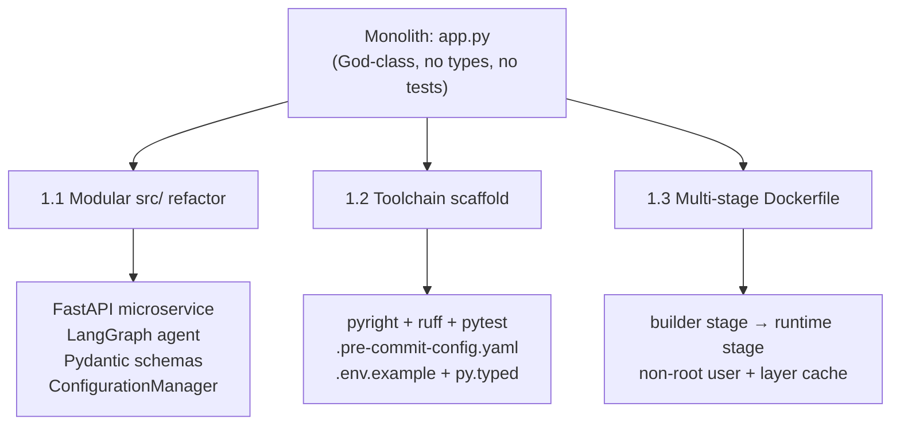

# Phase 1 — Foundation Hardening: Technical Implementation

> **Reference:** [`portfolio_upgrade_analysis.md` — Phase 1, L43–102](../evaluations/portfolio_upgrade_analysis.md)
> **Status:** ✅ Complete — commit `058fdcc`
> **Goal:** Make the codebase defensible to a senior code reviewer.

---

## Overview

Phase 1 transformed a monolithic God-class prototype into a modular, type-safe, containerized system. This document captures the exact engineering decisions made during implementation — not the plan, but the execution.



---

## 1.1 — Modular `src/` Package Structure

### The Problem
The original `app.py` was a single file containing the LLM client, Streamlit UI, conversation memory, and configuration — all coupled together. Any modification to one concern required navigating unrelated code. A senior reviewer would immediately classify this as a "junior prototype."

### The Implementation

The monolith was dissolved into a strict separation of concerns:

```
src/
├── __init__.py
├── py.typed                  ← Marks package as typed (PEP 561)
├── constants.py              ← PROJECT_ROOT, LOGS_DIR path anchors
├── agents/
│   ├── __init__.py
│   └── graph.py              ← LangGraph StateGraph + SQLite checkpointer
├── api/
│   ├── __init__.py
│   └── app.py                ← FastAPI: /v1/chat, /v1/health
├── config/
│   ├── __init__.py
│   └── configuration.py      ← YAML → frozen dataclass (AppConfig)
├── entity/
│   ├── __init__.py
│   └── schema.py             ← Pydantic v2 request/response models
└── utils/
    ├── __init__.py
    ├── exceptions.py          ← ChatException, ModelTimeoutError
    └── logger.py             ← RotatingFileHandler + RichHandler
```

### Key Files Explained

#### `src/entity/schema.py` — API Contracts (Pydantic v2)

Pydantic models replace all untyped `dict` usage at the API boundary:

```python
class ChatRequest(BaseModel):
    prompt: str = Field(..., description="The user's prompt message.")
    use_cloud: bool = Field(False, description="Whether to use the cloud model.")
    session_id: Optional[str] = Field("default", description="Session ID for persisting memory.")

class ChatResponse(BaseModel):
    response: str = Field(..., description="The AI's generated response.")
    model_used: str = Field(..., description="The model tier used ('local' or 'cloud').")

class HealthResponse(BaseModel):
    status: str = Field(..., description="Health status (e.g., 'ok').")
```

> **Why this matters:** Every `/v1/chat` request is validated before any code executes. Invalid payloads return a structured 422 automatically — no manual validation code needed.

#### `src/config/configuration.py` — Frozen Dataclass Configuration

The `AppConfig` dataclass is frozen (`frozen=True`), making it immutable after creation:

```python
@dataclass(frozen=True)
class AppConfig:
    openrouter_api_key: str
    local_model_name: str
    remote_model_name: str
    local_base_url: str
    remote_base_url: str
```

The `ConfigurationManager.get_config()` method resolves values via a three-tier priority chain to prevent environment variable leakage between the host shell and the Docker container:

```
Priority 1: Docker-injected LLM_URL / LLM_MODEL (ground truth in Docker AI)
Priority 2: Explicit LOCAL_* / REMOTE_* env vars
Priority 3: YAML config file defaults (config.yaml)
```

This solved the production bug where the host shell's stale `OPENROUTER_API_KEY` was silently overriding the `.env` file value injected by Docker, causing `401 Unauthorized` errors.

#### `src/agents/graph.py` — LangGraph StateGraph with SQLite Checkpointer

The agent is a compiled `StateGraph` built at module load time:

```python
class GraphState(TypedDict):
    """Represents the shared state passed between nodes in the graph."""
    messages: Annotated[list[BaseMessage], add_messages]
```

The `add_messages` reducer from LangGraph handles message merging automatically — no manual list appending. The graph wires a single `chat_node` that reads `use_cloud` from the `RunnableConfig` to select the correct LLM at runtime:

```python
def chat_node(state: GraphState, config: RunnableConfig):
    use_cloud = config.get("configurable", {}).get("use_cloud", False)
    llm = llms["cloud"] if use_cloud else llms["local"]
    response = llm.invoke(state["messages"])
    return {"messages": [response]}
```

Persistence is handled by `SqliteSaver`, which checkpoints the full `GraphState` to `checkpoints.sqlite` after each node execution. This gives the agent **persistent session memory across container restarts** — the foundational Layer 2 of the three-layer memory architecture (Phase 2.2).

```python
conn = sqlite3.connect(db_path, check_same_thread=False)
memory = SqliteSaver(conn)
memory.setup()
return builder.compile(checkpointer=memory)
```

#### `src/api/app.py` — FastAPI Microservice

The FastAPI app wraps the agent graph with versioned routes:

```
GET  /v1/health  → HealthResponse(status="ok")
POST /v1/chat    → ChatRequest → agent_graph.invoke() → ChatResponse
```

Session identity is routed through LangGraph's `thread_id` configurable:

```python
config = {
    "configurable": {
        "thread_id": request.session_id,
        "use_cloud": request.use_cloud,
    }
}
result = agent_graph.invoke({"messages": [user_message]}, config=config)
```

This means each unique `session_id` maintains its own isolated conversation history in the SQLite checkpoint store.

#### `src/utils/logger.py` — Structured Logger

The logger uses `RotatingFileHandler` (5 MB max, 5 backup files) combined with `RichHandler` for console output with traceback rendering. A guard (`if not logger.handlers`) prevents duplicate handler registration across multi-module imports:

```python
logger = get_logger(__name__, headline="api")
```

Every module gets its own named logger that writes to `logs/running_logs.log`, with visual `=== START: <module> ===` separators to aid debugging across service boundaries.

---

## 1.2 — Toolchain Scaffold

### The Problem
The original `pyproject.toml` had zero tooling configuration — no linter rules, no type checker settings, no test runner config. This signals to a senior reviewer that the project has never been statically analyzed and may contain silent type errors throughout.

### The Implementation

All tooling is configured in a single `pyproject.toml`:

```toml
[tool.pyright]
pythonVersion = "3.12"
typeCheckingMode = "standard"

[tool.ruff.lint]
select = ["E", "F", "I", "UP", "N", "W", "B", "SIM", "C4", "RUF"]

[tool.pytest.ini_options]
testpaths = ["tests"]

[dependency-groups]
dev = [
    "httpx>=0.28.1",
    "pytest>=9.0.3",
    "pytest-asyncio>=1.3.0",
]
```

**Ruff rule groups selected:**

| Code | Category | Purpose |
|---|---|---|
| `E`, `W` | pycodestyle | PEP 8 style errors and warnings |
| `F` | pyflakes | Undefined names, unused imports |
| `I` | isort | Import ordering enforcement |
| `UP` | pyupgrade | Upgrade to modern Python syntax |
| `N` | pep8-naming | Naming conventions |
| `B` | flake8-bugbear | Common bugs and design issues |
| `SIM` | flake8-simplify | Simplifiable code patterns |
| `C4` | flake8-comprehensions | Better list/dict/set comprehensions |
| `RUF` | Ruff-specific | Ruff's own high-signal rules |

### Supporting Files Added

**`.pre-commit-config.yaml`** — Enforces quality gates on every commit:
```yaml
repos:
  - repo: https://github.com/pre-commit/pre-commit-hooks
    hooks:
      - id: trailing-whitespace
      - id: end-of-file-fixer
      - id: check-yaml
      - id: check-added-large-files
      - id: check-toml

  - repo: https://github.com/astral-sh/ruff-pre-commit
    rev: v0.4.4
    hooks:
      - id: ruff
        args: [ --fix ]
      - id: ruff-format
```

**`.env.example`** — Documents required environment variables without committing secrets:
```bash
OPENROUTER_API_KEY=sk-or-v1-your-key-here
LOCAL_MODEL_NAME=ai/devstral-small-2
REMOTE_MODEL_NAME=google/gemma-3-27b-it
LOCAL_BASE_URL=http://model-runner.docker.internal/engines/v1
REMOTE_BASE_URL=https://openrouter.ai/api/v1
```

**`src/py.typed`** — An empty PEP 561 marker file that tells `pyright` and other type checkers that the `src` package ships with inline type annotations. Without this, external tools may skip type-checking your library entirely.

---

## 1.3 — Multi-Stage Dockerfile Hardening

### The Problem
The original Dockerfile had four production violations:

| Violation | Risk |
|---|---|
| No multi-stage build | Every image contains build tools, test dependencies, and dev packages — adding ~300MB to the image layer |
| `pip install uv` on every rebuild | Slow rebuild loop; `uv` version is not pinned |
| No non-root user | Any code execution breakout runs as `root` inside the container |
| `COPY . .` before `pip install` | Every source code change invalidates the dependency layer cache, forcing a full reinstall |

### The Implementation

```dockerfile
# Stage 1: builder — installs all dependencies into .venv
FROM python:3.12-slim AS builder
RUN pip install uv
WORKDIR /app
COPY pyproject.toml uv.lock ./          # ← Only dependency files, preserves cache
RUN uv sync --frozen --no-dev          # ← Locked, reproducible, no dev deps

# Stage 2: runtime — clean image, only copies the built .venv and source
FROM python:3.12-slim AS runtime
RUN adduser --disabled-password appuser # ← Non-root principal
WORKDIR /app
COPY --from=builder /app/.venv ./.venv  # ← Zero build tools in final image
COPY src/ ./src/
COPY gui.py ./

RUN chown -R appuser:appuser /app       # ← Grant write access for SQLite checkpoint DB
USER appuser

ENV PATH="/app/.venv/bin:$PATH"
```

**Layer cache strategy:** `pyproject.toml` and `uv.lock` are copied first (Stage 1). Docker will only re-run `uv sync` if these files change. All subsequent `COPY src/` commands do not invalidate the dependency layer — meaning iterative development rebuilds take seconds, not minutes.

**`uv sync --frozen`:** The `--frozen` flag refuses to resolve dependencies at build time. It strictly installs from `uv.lock`, guaranteeing bit-for-bit reproducible environments across all developers and CI runners.

### `.dockerignore` Protection

The `.dockerignore` file prevents the build context from including:
- `checkpoints.sqlite` — runtime state should never be baked into an image
- `.venv/` — the virtual environment is rebuilt inside the container, not copied from host
- `.env` — secrets must never enter an image layer

---

## Validation

All three sub-phases were validated end-to-end:

```
✅ docker-compose up --build  →  Services started (backend:8000, frontend:8501)
✅ GET /v1/health             →  {"status": "ok"}
✅ POST /v1/chat (local)      →  Routed to ai/devstral-small-2 via Docker AI Provider
✅ POST /v1/chat (cloud)      →  Routed to OpenRouter (google/gemma-3-27b-it) — 200 OK
✅ Session persistence        →  thread_id maintained across requests via checkpoints.sqlite
✅ pyright                    →  Standard mode — 0 errors
✅ ruff check                 →  0 violations
```

---

## What Phase 1 Unlocks

Phase 1 is the prerequisite gate for every subsequent phase. Specifically:

- **Phase 2 (Agentic Upgrade):** The `StateGraph` scaffold in `graph.py` is already wired for tool-calling nodes. Adding tools requires only `builder.add_node()` calls without touching the API layer.
- **Phase 3 (CI/CD):** `pyproject.toml` is fully configured — GitHub Actions can invoke `ruff check`, `pyright`, and `pytest` with zero additional configuration.
- **Phase 4 (Documentation):** The modular structure makes system diagrams accurate and maintainable — each box in a Mermaid diagram maps to exactly one directory in `src/`.
