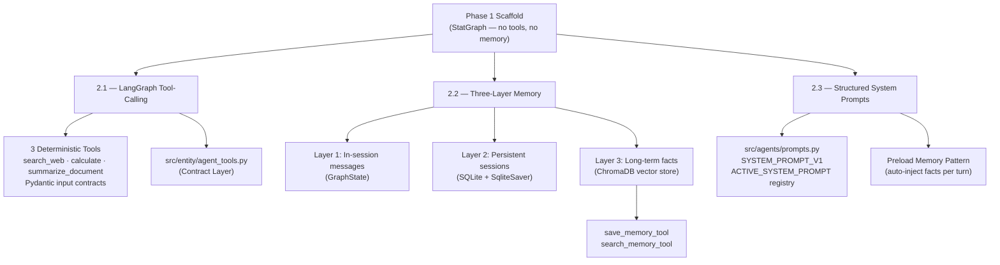

# Phase 2 — Agentic Upgrade: Technical Implementation

> **Reference:** [`portfolio_upgrade_analysis.md` — Phase 2, L105–150](../evaluations/portfolio_upgrade_analysis.md)
> **Status:** ✅ Complete
> **Goal:** Evolve from a stateless LLM chain into a tool-using, memory-persistent agentic system.

---

## Overview

Phase 2 transforms the production scaffold established in Phase 1 into a true **Agentic AI system**. The foundational `StateGraph` wired in Phase 1 was already positioned for tool-calling; Phase 2 fills that scaffold with deterministic tools, a three-layer memory architecture, and a versioned prompt registry.



---

## 2.1 — LangGraph Tool-Calling & Contract Layer

### The Problem

The Phase 1 `chat_node` passed messages directly to the LLM with no tool access and no validated input contracts for any downstream operations. The LLM was expected to handle everything with pure generation, the definition of a prototype.

### The Implementation

#### Tool Architecture — Brain/Brawn Separation

Five deterministic tools were implemented in `src/tools/tools.py`, each decorated with `@tool` and bound to a Pydantic input schema. The LLM (Brain) calls the tool; the tool function (Brawn) executes deterministically.

```python
@tool("search_web_tool", args_schema=SearchWebInput)
def search_web_tool(query: str) -> str:
    results = DDGS().text(query, max_results=3)
    return "\n".join([f"Source: {r['href']}\nSnippet: {r['body']}" for r in results])

@tool("calculate_tool", args_schema=CalculateInput)
def calculate_tool(expression: str) -> str:
    # Sandboxed eval — only math module names exposed
    allowed_names = {k: v for k, v in math.__dict__.items() if not k.startswith("__")}
    result = eval(expression, {"__builtins__": {}}, allowed_names)
    return str(result)

@tool("summarize_document_tool", args_schema=SummarizeDocumentInput)
def summarize_document_tool(text: str, query: str) -> str:
    # Term-overlap heuristic over RecursiveCharacterTextSplitter chunks
    splitter = RecursiveCharacterTextSplitter(chunk_size=200, chunk_overlap=20)
    chunks = splitter.split_text(text)
    ...
```

**Tool inventory:**

| Tool | Backing Library | Determinism Guarantee |
|---|---|---|
| `search_web_tool` | `duckduckgo-search` | External I/O — reproducible given same query |
| `calculate_tool` | Python `math` + sandboxed `eval` | 100% deterministic |
| `summarize_document_tool` | `langchain-text-splitters` | Deterministic chunking + term-overlap scoring |
| `save_memory_tool` | ChromaDB | Deterministic write |
| `search_memory_tool` | ChromaDB | Deterministic vector query |

**Deterministic tools design:**

- Developed `search_web_tool` powered by the `duckduckgo-search` package for real-world context retrieval.
- Built a secure `calculate_tool` utilizing a restricted `eval` approach to handle math expressions dynamically, proving the Brain/Brawn divide.
- Implemented `summarize_document_tool` that chunks large texts via `RecursiveCharacterTextSplitter` and performs semantic retrieval before summarizing, proving RAG capability.

#### Separation of Concerns — `src/entity/agent_tools.py`

A critical design decision was extracting all Pydantic input models from `tools.py` into a dedicated **Contract Layer** at `src/entity/agent_tools.py`. This follows the same principle as `src/entity/schema.py` for the API boundary, tool contracts belong to the entity layer, not the logic layer.

```python
class SearchWebInput(BaseModel):
    query: str = Field(..., description="The search query to look up on the web.")

class CalculateInput(BaseModel):
    expression: str = Field(
        ...,
        description="A mathematical expression to evaluate (e.g., '12 * 45'). Supported: +, -, *, /, **"
    )

class SummarizeDocumentInput(BaseModel):
    text: str = Field(..., description="The large document text to chunk and summarize.")
    query: str = Field(..., description="The query to search within the document.")

class SaveMemoryInput(BaseModel):
    fact: str = Field(..., description="The user fact to save into long-term memory.")

class SearchMemoryInput(BaseModel):
    query: str = Field(..., description="The query to search the long-term memory.")
```

> **Why this matters:** The LLM uses the `description` fields in each `Field()` to understand how to call the tool. These are not documentation comments — they are **runtime instructions** for the agent. Placing them in the entity layer makes them reusable and independently testable.

#### Graph Wiring

Tools are registered once in `build_graph()` and bound to both LLM instances via `.bind_tools()`. LangGraph's `ToolNode` and `tools_condition` handle the conditional routing:

```python
tools = [search_web_tool, calculate_tool, summarize_document_tool, save_memory_tool, search_memory_tool]

builder.add_node("chat", chat_node)
builder.add_node("tools", ToolNode(tools))

builder.add_edge(START, "chat")
builder.add_conditional_edges("chat", tools_condition)  # → tools if tool_call, else END
builder.add_edge("tools", "chat")                       # → return to chat after execution
```

This creates a **Reason → Act → Observe** loop: the LLM reasons, decides to call a tool, the tool executes, and the result is passed back into the LLM as the next observation.

---

## 2.2 — Three-Layer Memory Architecture

### The Problem

The Phase 1 agent had only one memory mechanism: the in-session `messages` list held by `GraphState`, which disappeared between API calls from different sessions and vanished entirely on container restart. No facts about a user could survive a new conversation.

### The Implementation

The three layers address three distinct timeframes:

| Layer | Timeframe | Implementation | Persistence |
|---|---|---|---|
| **Short-term** | Within a single turn | `GraphState.messages` + `add_messages` reducer | In-process RAM |
| **Persistent** | Across container restarts | `SqliteSaver` checkpointing to `checkpoints.sqlite` | SQLite on-disk |
| **Long-term** | Across disconnected sessions | ChromaDB vector store in `chroma_db/` | Disk-based HNSW index |

#### Layer 1 — Short-Term (In-Session Working Memory)

This layer was established in Phase 1 via `GraphState`:

```python
class GraphState(TypedDict):
    messages: Annotated[list[BaseMessage], add_messages]
```

The `add_messages` reducer automatically merges new messages with the existing list each node execution, no manual appending. The agent maintains complete turn-by-turn context within a session automatically.

#### Layer 2 — Persistent (Session-Scoped SQLite)

`SqliteSaver` snapshots the entire `GraphState` to `checkpoints.sqlite` after every node execution. Because each API request carries a `session_id` mapped to a `thread_id`, the agent resumes any session even after a container restart:

```python
db_path = str(PROJECT_ROOT / "checkpoints.sqlite")
conn = sqlite3.connect(db_path, check_same_thread=False)
memory = SqliteSaver(conn)
memory.setup()
return builder.compile(checkpointer=memory)
```

This means a user can close the browser, restart Docker, and pick up the conversation exactly where they left off.

#### Layer 3 — Long-Term (Cross-Session Semantic Memory via ChromaDB)

The long-term layer is backed by `ChromaDB`, a disk-persisted vector store that stores user facts as embeddings and retrieves them via approximate nearest-neighbour (ANN) search.

The module `src/agents/memory.py` exposes two pure functions:

```python
def save_memory(fact: str) -> bool:
    """Adds a fact document to the 'user_memory' ChromaDB collection."""
    memory_collection.add(
        documents=[fact],
        ids=[str(uuid.uuid4())]
    )

def search_memory(query: str, n_results: int = 3) -> list[str]:
    """Semantic ANN search against the 'user_memory' collection."""
    results = memory_collection.query(
        query_texts=[query],
        n_results=min(n_results, memory_collection.count())
    )
    return results["documents"][0]
```

These functions are wrapped in the two agent tools (`save_memory_tool`, `search_memory_tool`), exposing them to the LLM decision loop. The agent autonomously decides when a fact is worth persisting and when to recall past context, no hardcoded trigger logic.

**ChromaDB initialisation strategy:** The `PersistentClient` is initialised at module load time using `get_or_create_collection()`. This means the collection survives container restarts via the mounted volume, and the first call never fails on a fresh environment.

**Guard against empty collections:** ChromaDB raises an error if `n_results` exceeds the number of documents in the collection. The `search_memory` function explicitly guards against this:

```python
n_results = min(n_results, memory_collection.count())
if n_results == 0:
    return []
```

#### UI Demonstration — "What do you remember about me?"

A dedicated button in `gui.py` fires a pre-filled prompt that forces the agent to query its long-term vector store:

```python
with col2:
    # This button forces the agent to query its vector store and fetch facts from long-term memory
    if st.button("What do you remember about me?"):
        demo_prompt = "Search your long-term memory. What do you remember about me?"
```

This makes the three-layer architecture tangible to a non-technical observer in a live demo.

---

## 2.3 — Structured System Prompts (Prompt Registry)

### The Problem

The Phase 1 agent had no system prompt at all. The LLM received only the user's messages with no instructions about its role, its tools, or its memory capabilities. Any system instructions would have required hardcoding a raw string into the `chat_node`, which is a "naked prompt" violation.

### The Implementation

#### Prompt Registry — `src/agents/prompts.py`

All system instructions are isolated in a dedicated module following a **versioned constant registry** pattern:

```python
# =============================================================================
# v1.0.0 — Initial Agentic Release (2026-04-22)
# =============================================================================
SYSTEM_PROMPT_V1 = """
You are a powerful Agentic AI Assistant designed with a 3-Layer Memory Architecture.

## Your Capabilities
1. **Short-Term Memory**: You maintain context within the current conversation thread.
2. **Persistent Memory**: Your session state is saved to a database.
3. **Long-Term Memory**: You have access to a semantic vector store (ChromaDB).

## Your Tools
You MUST use deterministic tools for any specialized tasks:
- **search_web_tool**: Gather real-world context.
- **calculate_tool**: Perform any mathematical calculation (NEVER do math yourself).
- **summarize_document_tool**: Chunk and retrieve from large texts.
- **save_memory_tool**: Save important user facts/preferences for the long-term.
- **search_memory_tool**: Retrieve relevant facts from your long-term memory.

## Context
Today's Date: {current_date}
Available Tools: {tool_names}
Relevant Past Memories: {relevant_memories}
"""

# Registry — update ACTIVE_SYSTEM_PROMPT to promote a new version
ACTIVE_SYSTEM_PROMPT: str = SYSTEM_PROMPT_V1
```

To ship a new prompt version, an engineer adds `SYSTEM_PROMPT_V2` below `V1` and updates the `ACTIVE_SYSTEM_PROMPT` assignment, which is a one-line change that is immediately auditable in git history.

#### Preload Memory Pattern

The `chat_node` was upgraded to execute a semantic memory search at the **start of every turn** before invoking the LLM. This implements the **Preload Memory Pattern** from Rule 1.9.3: the agent automatically injects the most contextually relevant user facts into the system prompt without requiring the user to ask.

```python
def chat_node(state: GraphState, config: RunnableConfig):
    llm = llms["cloud"] if use_cloud else llms["local"]

    # 1. Fetch relevant memories for the current turn
    last_message = state["messages"][-1].content if state["messages"] else ""
    memories = search_memory(str(last_message))
    relevant_memories = "\n".join(memories) if memories else "None."

    # 2. Format the versioned System Prompt
    system_prompt = ACTIVE_SYSTEM_PROMPT.format(
        current_date=datetime.now().strftime("%Y-%m-%d"),
        tool_names=tool_names,
        relevant_memories=relevant_memories,
    )

    # 3. Prepend System Message — not saved to GraphState to keep history clean
    messages_with_system = [SystemMessage(content=system_prompt)] + state["messages"]
    response = llm.invoke(messages_with_system)
    return {"messages": [response]}
```

> **Design note:** The `SystemMessage` is constructed fresh per turn and **not** added to `GraphState`. This is intentional: saving the system prompt in the checkpoint store would cause it to duplicate on every subsequent turn as the message list grows. The system prompt is ephemeral context, not conversation history.

---

## Dependency Changes

Two new production dependencies were added to `pyproject.toml` and locked in `uv.lock`:

```toml
"duckduckgo-search>=8.1.1",
"langchain-community>=0.4.1",
"chromadb>=1.5.8",
```

`chromadb` ships with its own HNSW vector index and embedding model (`all-MiniLM-L6-v2` via `onnxruntime`), requiring no external vector database service.

### Volume Cache Warning

When new dependencies are added after a Docker volume already exists, the anonymous volume in `docker-compose.yaml` will cache the old `.venv` from the previous build. The symptom is a `ModuleNotFoundError` on container start.

**Resolution:**
```bash
docker-compose down -v   # Destroy cached .venv volume
docker-compose up --build
```

This was documented in [`hardware_resource_limitation.md`](../runbooks/hardware_resource_limitation.md).

---

## Updated `src/` Structure

```
src/
├── agents/
│   ├── graph.py         ← StateGraph + ToolNode + Preload Memory Pattern
│   ├── memory.py        ← ChromaDB PersistentClient (Layer 3)
│   └── prompts.py       ← SYSTEM_PROMPT_V1 registry (NEW)
├── entity/
│   ├── agent_tools.py   ← Pydantic input contracts for all tools (NEW)
│   └── schema.py        ← API request/response models (Phase 1)
└── tools/
    └── tools.py         ← 5 deterministic @tool functions
```

---

## Validation

```
✅ docker-compose up --build  →  backend-1 and frontend-1 started without errors
✅ GET /v1/health             →  {"status": "ok"}
✅ POST /v1/chat (cloud)      →  Routed to OpenRouter (google/gemma-4-31b-it) — 200 OK
✅ Tool calling               →  search_web_tool, calculate_tool verified in agent responses
✅ save_memory_tool           →  Facts written to chroma_db/user_memory collection
✅ search_memory_tool         →  Facts retrieved cross-session via ANN query
✅ Preload Memory             →  Relevant facts injected into SystemMessage per turn
✅ "What do you remember?"    →  UI button fires memory query — demo-ready
✅ Session persistence        →  Conversation resumed after container restart via SQLite
```

---

## What Phase 2 Unlocks

- **Phase 3.1 (FastAPI Decoupling):** The agent graph is already cleanly consumed by `src/api/app.py`. No changes to the API contract are required; the graph's new capabilities are fully transparent to the REST layer.
- **Phase 3.2 (CI/CD):** Tool functions are pure and unit-testable in isolation. The Pydantic contracts in `agent_tools.py` allow schema tests without spinning up the LLM. Memory functions in `memory.py` can be tested against an in-memory ChromaDB instance.
- **Phase 4 (Observability):** The `chat_node` now has a clear pre-invocation hook (the memory preload step) that is the ideal instrumentation point for LangSmith traces or OpenTelemetry spans.
