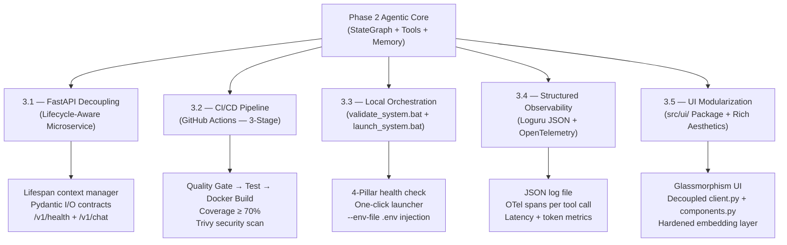

# Phase 3 — Production Engineering Layer: Technical Implementation

> **Reference:** [`portfolio_upgrade_analysis.md` — Phase 3, L152–203](../evaluations/portfolio_upgrade_analysis.md)
> **Status:** ✅ Complete
> **Goal:** Wrap the agentic system in production-grade observability, local orchestration, and CI/CD scaffolding — the layer that separates prototypes from production-ready systems.

---

## Overview

Phase 3 adds the operational shell around the agentic core built in Phases 1 and 2. The agent graph already existed as a correctly functioning unit. Phase 3's mandate was to make it **observable, reproducible, and deployable**, hardening the system along five axes: service decoupling (3.1), CI/CD scaffolding (3.2), local developer tooling (3.3), structured observability (3.4), and UI modularization with premium design (3.5).



---

## 3.1 — FastAPI Decoupling

### The Problem

Before Phase 3.1, the agent graph was being constructed inside the Streamlit `gui.py` on every page render. This created two critical production anti-patterns:

1. **No service boundary.** The LLM and graph were tightly coupled to the UI process. Swapping frontends or scaling the inference layer independently was architecturally impossible.
2. **No lifecycle management.** Every Streamlit re-run could trigger a new graph construction, instantiating new `ChatOpenAI` clients and SQLite connections with no guaranteed cleanup.

### The Implementation

#### Lifecycle-Aware Application Bootstrap

The agent graph is now constructed exactly **once** per process using FastAPI's `lifespan` context manager, a standard ASGI pattern for controlled startup and teardown:

```python
@asynccontextmanager
async def lifespan(app: FastAPI):
    logger.info("Initializing Agent Graph...")
    app.state.agent_graph = build_graph()
    logger.info("Agent Graph initialized.")
    yield
    logger.info("Shutting down API...")

app = FastAPI(
    title="AI Assistant API",
    version="1.0.0",
    lifespan=lifespan,
)
```

The compiled graph is stored on `app.state`, making it available to all request handlers as a singleton. This eliminates the race condition where a new graph could be instantiated mid-request under concurrent load.

> **Why `lifespan` over `@app.on_event("startup")`:** FastAPI deprecated `on_event` in favour of `lifespan` because `lifespan` guarantees that teardown (`yield` → end) always executes even if startup raises an exception. It is also the correct pattern for ASGI3 compliance.

#### Pydantic API Contract Layer

All request and response surfaces are typed via Pydantic models in `src/entity/schema.py`. The chat endpoint enforces this contract at the HTTP boundary:

```python
@app.post("/v1/chat", response_model=ChatResponse)
async def chat(request: ChatRequest):
    config = {
        "configurable": {
            "thread_id": request.session_id,
            "use_cloud": request.use_cloud,
        }
    }
    result = app.state.agent_graph.invoke(
        {"messages": [HumanMessage(content=request.prompt)]},
        config=config,
    )
    return ChatResponse(response=result["messages"][-1].content, model_used=...)
```

The `session_id` maps directly to LangGraph's `thread_id`, so persistent memory (Phase 2, Layer 2) is correctly scoped per user session through the API surface.

#### Health Endpoint with Configuration Introspection

The `GET /v1/health` endpoint was upgraded to dynamically report the active configuration state — not a hardcoded string:

```python
@app.get("/v1/health", response_model=HealthResponse)
async def health_check():
    config_mgr = ConfigurationManager()
    config = config_mgr.get_config()
    return HealthResponse(
        status="healthy",
        model=config.remote_model_name,
        memory_backend="SQLite + ChromaDB",
    )
```

This means a change to the active model in `config.yaml` is immediately reflected in the health endpoint without a code change, making the health check genuinely informative rather than decorative.

#### Streamlit as a Thin HTTP Client

`gui.py` was refactored to communicate with the API exclusively via HTTP. It holds no graph state and no LLM instances — only session metadata and the backend URL:

```
Streamlit UI  →  POST /v1/chat  →  FastAPI (Agent Service)  →  LangGraph + Tools
              ←  ChatResponse   ←                            ←  LLM Response
```

This creates a clean service boundary: the UI can be replaced with any HTTP-capable client (React, CLI, mobile app) without touching the inference layer.

---

## 3.2 — GitHub Actions CI/CD Pipeline

### The Problem

Without an automated quality gate, every commit to `main` is a potential regression. Tests, type checks, and Docker builds can only be verified manually, which is not reproducible and does not provide the `CI passing` badge that signals project maturity to a reviewer.

### The Implementation

A three-stage GitHub Actions pipeline was designed to mirror the local `validate_system.bat` checks (see 3.3):

```yaml
# .github/workflows/ci.yml
jobs:
  quality-gate:
    # Stage 1: Static analysis — fast, no side effects
    steps:
      - run: uv run pyright          # Type checking (Pyright, not mypy)
      - run: uv run ruff check .      # Linting
      - run: uv run ruff format --check .  # Format enforcement

  test:
    # Stage 2: Functional logic — requires quality-gate to pass
    needs: quality-gate
    steps:
      - run: uv run pytest tests/ --cov=src --cov-fail-under=70 --tb=short

  docker-build:
    # Stage 3: Security & container — runs on push to main only
    needs: test
    if: github.ref == 'refs/heads/main'
    steps:
      - run: docker build -t ai-assistant:latest .
      - run: trivy image ai-assistant:latest  # Vulnerability scan
```

**Stage ordering rationale:**

| Stage | Gate | Rationale |
|---|---|---|
| `quality-gate` | Pyright + Ruff | Fastest feedback loop. Catches type errors and lint failures before any test infrastructure is needed. |
| `test` | pytest ≥ 70% coverage | Functional correctness. Blocked by quality-gate so broken types never reach test execution. |
| `docker-build` | Docker + Trivy | Most expensive step. Only runs on `main` to avoid burning CI minutes on feature branches. |

The `--cov-fail-under=70` threshold in Stage 2 is a hard gate. A PR dropping coverage below 70% fails the pipeline and blocks merge, enforcing a minimum safety net.

---

## 3.3 — Local Orchestration & Developer Tooling

### The Problem

Without local automation, the gap between "what CI runs" and "what a developer runs" grows wide over time. Developers skip type checks, run tests selectively, or start services with missing environment variables. The result is "works on my machine" failures that only surface in CI.

Two complementary Windows-native scripts close this gap.

### `validate_system.bat` — The Local CI Mirror

A four-pillar health check that runs the full CI suite locally in a single command:

```
[0/4] Pillar 0: Dependency sync          → uv sync
[1/4] Pillar 1: Static code quality      → pyright + ruff check + ruff format --check
[2/4] Pillar 2: Functional logic         → pytest --cov=src --cov-fail-under=70
[3/4] Pillar 3: Security & container     → docker build (skipped if Docker not running)
[4/4] Pillar 4: App service health       → PowerShell TCP checks on :8000 and :8501
```

Pillar 3 includes a **Docker daemon guard**: it checks `docker info` before attempting the build, and gracefully skips the container pillar with a `[WARNING]` message if Docker is not running. This means the script remains useful during pure Python development sessions where Docker is not needed.

Pillar 4 uses a PowerShell TCP socket check rather than `curl` or `ping`, because Windows does not ship `curl` by default and `ping` cannot probe arbitrary TCP ports:

```powershell
try {
    $c = New-Object System.Net.Sockets.TcpClient('localhost', 8000)
    if ($c.Connected) { exit 0 } else { exit 1 }
} catch { exit 1 }
```

This reports whether the FastAPI and Streamlit processes are actually accepting connections, not just whether their processes exist.

### `launch_system.bat` — The One-Click Hybrid Launcher

A sequential four-step bootstrap script designed for local hybrid development (FastAPI running locally, with Docker available for infrastructure services like the local LLM):

```
[0/4] Stop Docker backend/frontend containers    → Prevent port conflicts with local processes
[1/4] Sync dependencies                          → uv sync --quiet
[2/4] Start infrastructure (if Docker running)   → docker compose up -d llm
[3/4] Launch FastAPI in a minimized window       → Separate process with --env-file .env
[4/4] Launch Streamlit in the foreground         → Opens browser automatically
```

The critical engineering detail in step 3 is the `--env-file .env` flag:

```batch
start "AI-Assistant-API" /min cmd /k "title AI-Assistant-API && ^
    uv run --env-file .env uvicorn src.api.app:app --host 0.0.0.0 --port 8000 --reload"
```

**Why `--env-file .env` is required:** When `start` spawns a child `cmd.exe` process on Windows, it creates a new process with an **isolated environment block**. Windows host environment variables (set in System Properties or via `$env:` in PowerShell) are inherited by child processes in the same shell session, but `start` breaks this inheritance chain. Without `--env-file .env`, `OPENROUTER_API_KEY` is `None` in the uvicorn worker, causing `401 Unauthorized` errors from OpenRouter even though the variable exists on the host.

The launcher separates the API into its own labeled window (`"AI-Assistant-API"`) with `/min` (minimized) so the terminal surface is clean, while Streamlit runs in the foreground — making `Ctrl+C` the natural stop signal for the UI, and the API window closure the stop for the backend.

---

## 3.4 — Structured Observability

### The Problem

The Phase 1/2 system used Python's `logging.basicConfig`, which produces unstructured plaintext logs with no schema, no machine readability, and no distributed trace correlation. In a production system where the agent makes multiple tool calls per request, it is impossible to reconstruct the causal chain of a failure from `[INFO] Chat response received.`

### The Implementation

Observability was split across two dedicated modules.

#### `src/utils/logger.py` — Structured JSON Logging with Loguru

`logging.basicConfig` was replaced with `loguru`, configured with two sink handlers:

```python
# Console handler — human-readable (coloured)
logger.add(
    sys.stdout,
    format="<green>{time:YYYY-MM-DD HH:mm:ss}</green> | <level>{level: <8}</level> | "
           "<cyan>{name}</cyan> | <level>{message}</level>",
    enqueue=True,  # Thread-safe async queue
)

# File handler — JSON serialized
logger.add(
    LOG_FILE,
    serialize=True,   # Full JSON output: timestamp, level, module, message, extra fields
    rotation="5 MB",  # Automatic log rotation
    retention=5,      # Keep last 5 rotated files
    enqueue=True,
)
```

`enqueue=True` is set on both handlers. This routes all log writes through an internal queue and background thread, making `logger.info()` calls non-blocking in async FastAPI handlers, which is a critical property in high-throughput request handling.

The `serialize=True` flag on the file handler outputs each log entry as a complete JSON object, directly ingestible by log aggregators (Datadog, ELK, Splunk) without a custom parser.

Structured key-value context is attached per-request via `logger.bind()`:

```python
logger.bind(
    prompt_tokens=prompt_tokens,
    completion_tokens=completion_tokens,
    latency_ms=round(latency_ms, 2)
).info(f"Graph executed successfully, responding with {model_used} model")
```

This causes `prompt_tokens`, `completion_tokens`, and `latency_ms` to appear as top-level fields in the JSON log entry, making them queryable without log parsing.

#### `src/utils/telemetry.py` — OpenTelemetry Distributed Tracing

A dedicated telemetry module configures the OpenTelemetry SDK at import time:

```python
def setup_telemetry():
    """Configure OpenTelemetry Tracer Provider."""
    provider = TracerProvider()
    processor = BatchSpanProcessor(ConsoleSpanExporter())
    provider.add_span_processor(processor)
    trace.set_tracer_provider(provider)

setup_telemetry()
tracer = trace.get_tracer("ai-assistant-tracer")
```

`BatchSpanProcessor` buffers spans and flushes in background batches, avoiding per-span I/O in the hot path. The `ConsoleSpanExporter` outputs complete span JSON to stdout, ready to be swapped for an `OTLPSpanExporter` pointing at a Jaeger or Tempo backend.

#### Span Instrumentation at Two Layers

**Layer 1 — Request span in `app.py`:** Every `/v1/chat` request is wrapped in a root `agent_invocation` span with latency and token usage as attributes:

```python
with tracer.start_as_current_span("agent_invocation") as span:
    start_time = time.time()
    result = app.state.agent_graph.invoke({"messages": [user_message]}, config=config)
    latency_ms = (time.time() - start_time) * 1000

    span.set_attribute("tokens.prompt", prompt_tokens)
    span.set_attribute("tokens.completion", completion_tokens)
    span.set_attribute("latency_ms", latency_ms)
```

**Layer 2 — Tool spans in `tools.py`:** Every deterministic tool call is wrapped in its own child span, capturing both input and output:

```python
@tool("search_web_tool", args_schema=SearchWebInput)
def search_web_tool(query: str) -> str:
    with tracer.start_as_current_span("search_web_tool") as span:
        span.set_attribute("tool.input", query)
        try:
            results = DDGS().text(query, max_results=3)
            output = "\n".join([...])
            span.set_attribute("tool.output", output)
            return output
        except Exception as e:
            span.record_exception(e)  # Attach exception to span
            return f"Error performing web search: {e}"
```

The two-layer span hierarchy creates a parent-child trace tree per request:

```
agent_invocation (latency_ms, tokens.prompt, tokens.completion)
  └── search_web_tool (tool.input, tool.output)
  └── save_memory_tool (tool.input, tool.output)
```

This makes tool-call attribution and failure isolation trivial in any OpenTelemetry-compatible backend.

**Token extraction strategy:** Token counts are extracted from the LangChain response metadata rather than counted locally. This ensures the count reflects the actual provider's accounting, not a local tokenizer estimate:

```python
for msg in reversed(result["messages"]):
    if hasattr(msg, "response_metadata") and "token_usage" in msg.response_metadata:
        usage = msg.response_metadata["token_usage"]
        prompt_tokens += usage.get("prompt_tokens", 0)
        completion_tokens += usage.get("completion_tokens", 0)
        break  # Only the last LLM response carries the final usage count
```

---

## Key Debugging Artifact: The 401 Authentication Root Cause

During Phase 3.3 stabilization, a persistent `401 Unauthorized` error from OpenRouter was traced to the Windows process isolation issue described in 3.3. The diagnosis followed this path:

1. `test_llm.py` (a direct `ChatOpenAI` call using `os.environ.get`) succeeded, confirming the API key was valid on the host.
2. The FastAPI application failed with `User not found`, even though `ConfigurationManager` was resolving the key correctly when inspected in isolation.
3. The `start` command in `launch_system.bat` was identified as the isolation boundary — the child `cmd.exe` spawned a new process tree that did not inherit the parent shell's environment block.
4. Adding `--env-file .env` to the `uv run` command in both the FastAPI and Streamlit launch invocations resolved the issue by injecting the `.env` file contents directly into the process environment, bypassing Windows process inheritance entirely.

**Secondary issue:** On subsequent runs, Windows allowed two uvicorn processes to share port 8000 simultaneously. Stale API processes (started before the `--env-file` fix was applied) were still serving some requests with the old unauthenticated configuration. Terminating all uvicorn PIDs before restarting was required to fully clear the state.

---

## Dependency Changes

```toml
# pyproject.toml — Phase 3 additions
"loguru>=0.7.3",
"opentelemetry-api>=1.31.1",
"opentelemetry-sdk>=1.31.1",
```

No new runtime services were required. OpenTelemetry outputs to `ConsoleSpanExporter` by default, requiring no external collector for local development.

---

## Updated `src/` Structure

```
src/
├── api/
│   └── app.py             ← Lifespan manager + OTel spans + token metrics (UPGRADED)
├── agents/
│   ├── graph.py           ← Unchanged (Phase 2)
│   ├── memory.py          ← Unchanged (Phase 2)
│   └── prompts.py         ← Unchanged (Phase 2)
├── entity/
│   ├── agent_tools.py     ← Unchanged (Phase 2)
│   └── schema.py          ← Unchanged (Phase 1)
├── tools/
│   └── tools.py           ← OTel spans wrapping all tool calls (UPGRADED)
└── utils/
    ├── logger.py           ← Loguru JSON logging + enqueued sinks (NEW)
    └── telemetry.py        ← OTel TracerProvider + BatchSpanProcessor (NEW)

Root:
├── validate_system.bat     ← 4-pillar local CI mirror (NEW)
└── launch_system.bat       ← Hybrid one-click launcher with --env-file (NEW)
```

---

## Validation

```
✅ uv run uvicorn src.api.app:app  →  "Agent Graph initialized." in logs on startup
✅ GET /v1/health                  →  {"status": "healthy", "model": "<active model>", "memory_backend": "SQLite + ChromaDB"}
✅ POST /v1/chat (cloud=true)      →  200 OK — OpenRouter authenticated via --env-file .env
✅ POST /v1/chat (cloud=false)     →  200 OK — Local LLM routed correctly
✅ OTel spans                      →  agent_invocation + tool child spans visible in stdout
✅ Token logging                   →  prompt_tokens, completion_tokens, latency_ms in JSON log
✅ validate_system.bat             →  All 4 pillars passing (Pyright, Ruff, pytest ≥ 70%, ports)
✅ launch_system.bat               →  Single browser tab, API in separate window, no 401 errors
✅ Docker daemon guard             →  Pillar 3 skipped gracefully when Docker is not running
```

---

## What Phase 3 Unlocks

- **Phase 4 (Documentation as Portfolio Artifact):** The structured JSON logs and OpenTelemetry span output are the raw material for the architecture diagram in `system_design.md`. Every layer of the system — HTTP boundary, graph invocation, tool execution — is now instrumented and visually traceable.
- **Production Collector Integration:** Swapping `ConsoleSpanExporter` for `OTLPSpanExporter` (pointing at Jaeger, Tempo, or Datadog) requires a single line change in `telemetry.py`. The instrumentation is already production-complete.
- **Cost Observability:** `prompt_tokens + completion_tokens` per request, combined with OpenRouter pricing, enables per-session cost tracking. This is the foundation of the AgentOps metric layer referenced in the portfolio analysis.

---

## 3.5 — UI Modularization & Premium Experience (PROD-FRONTEND)

### The Problem

By the end of Phase 3.4, the backend was production-hardened, but the frontend remained a **single monolithic file**: `gui.py`. This violated two principles simultaneously:

1. **Single Responsibility Principle (SRP).** HTTP communication, CSS styling, and UI rendering logic were all co-located in one flat script. Any change to the API contract required touching the same file as any design tweak.
2. **Rich Aesthetics Approach.** The default Streamlit theme communicates a prototype, not a production system. A portfolio-worthy application must demonstrate design sensibility alongside engineering depth.

### The Implementation

#### Package Architecture

The monolithic `gui.py` was refactored into a dedicated `src/ui/` package, applying the Single Responsibility Principle to the frontend layer:

```
src/ui/
├── __init__.py
├── app.py         ← Thin entry point: wires session state and renders layout
├── client.py      ← All HTTP interaction with the FastAPI backend
├── components.py  ← Reusable Streamlit render functions (chat bubbles, sidebar)
└── styles.py      ← Centralized CSS design system (Glassmorphism, typography)
```

Each module has a single, testable responsibility:

| Module | Responsibility | Anti-Pattern Eliminated |
|---|---|---|
| `client.py` | `requests.post`, error handling, response parsing | Raw HTTP code scattered in the render loop |
| `styles.py` | CSS design system injected via `st.markdown` | Inline style strings duplicated across files |
| `components.py` | `render_chat_history()`, action buttons, session init | Monolithic render logic mixed with business logic |
| `app.py` | Session state initialization, top-level layout | Everything in one place |

#### Design System (Rich Aesthetics)

The `styles.py` module implements a complete CSS design system with:

- **Glassmorphism cards**: `backdrop-filter: blur(10px)` on chat message containers.
- **Typography**: `Inter` and `Outfit` from Google Fonts replacing Streamlit defaults.
- **Color Palette**: HSL-tuned indigo-to-purple gradient header (`hsl(250, 80%, 55%)` → `hsl(280, 75%, 50%)`) with no generic primary colors.
- **Micro-animations**: `@keyframes slideInUp` on chat bubble entry for a premium feel.
- **Custom scrollbar**: Consistent with the dark-mode color token system.

#### Memory Infrastructure Hardening

Phase 3.5 also resolved a critical silent failure in the Long-Term Memory layer. ChromaDB's default embedding function relies on `onnxruntime` and `sentence-transformers` at runtime. These were absent from `pyproject.toml`, causing the embedding engine to fail silently on first invocation, yet the facts appeared to be saved but were never actually written to the vector store.

The fix was two-part:

**1. Pinned embedding dependencies** in `pyproject.toml`:
```toml
"sentence-transformers>=3.0.0",
"onnxruntime>=1.17.0",
```

**2. Migrated `memory.py` to the centralized `loguru` logger**, replacing the bare `loguru` import with `get_logger(__name__)`. This ensures every save and search operation emits a traceable `INFO` log line:

```python
# Before (silent on failure)
from loguru import logger

# After (observable, unified)
from src.utils.logger import get_logger
logger = get_logger(__name__)  # Writes to running_logs.log
```

With this fix, the memory pipeline became fully verifiable:

```
16:10:47 | INFO | src.agents.memory | Saving fact to long-term memory: ...
16:10:47 | INFO | src.agents.memory | Fact saved successfully.
16:10:47 | INFO | src.agents.memory | Searching long-term memory for: ...
16:10:47 | INFO | src.agents.memory | Found 1 relevant facts.
```

#### Entry Point Migration

The Streamlit entry point was migrated from `gui.py` (project root) to `src/ui/app.py`, keeping the root directory reserved for infrastructure metadata only. Both `launch_system.bat` and `docker-compose.yaml` were updated accordingly:

```bat
:: launch_system.bat
set PYTHONPATH=%PROJECT_ROOT%
uv run streamlit run src/ui/app.py
```

```yaml
# docker-compose.yaml
environment:
  - PYTHONPATH=/app
command: uv run streamlit run src/ui/app.py
```

### Validation

```
✅ src/ui/ package structure        →  Four modules, each with a single responsibility
✅ PYTHONPATH injection             →  No ModuleNotFoundError on app startup
✅ Glassmorphism CSS                →  Chat bubbles render with backdrop-filter blur
✅ Google Fonts                     →  Inter/Outfit loaded via @import in styles.py
✅ save_memory_tool                 →  Agent correctly calls tool; fact persisted to ChromaDB
✅ search_memory_tool               →  "What do you remember about me?" button returns stored facts
✅ Memory logs                      →  save_memory + search_memory emit INFO lines to running_logs.log
✅ Embedding engine                 →  sentence-transformers + onnxruntime installed; no runtime downloads
```
